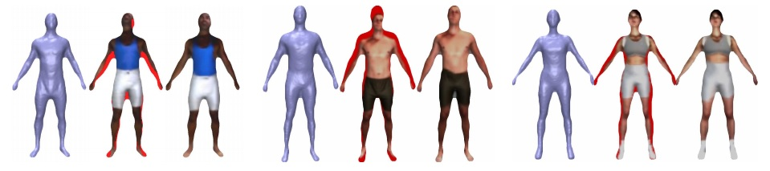

### Abstract
We present a system for automatically generating custom, structured image-maps for input depth-maps. Our system thus allows quick fitting of masses of objects with tailor-made image-maps. Given a depth-map of a novel 3D object, our method tiles it with intensities from similar, pre-collected, textured objects. These are seamlessly merged to form the new image-map. This process is performed by optimizing a well defined target likelihood function, via a hard-EM procedure. We present results for varied object classes including human figures, and fish.

[Download paper here](../projects/Coloralization/HassnerBasriEG06.pdf)

### Some Results
 
<b>Fish image-maps.</b> Top row, input depth-maps; bottom row, our output image-maps  

 
<b>Human image-maps.</b> Three human figure results. Using a single DB object, our method effectively morphs the DB image, automatically fitting it to the input depth’s 3D features. For each result, displayed from left to right, are the input depth, depth textured with automatically selected DB image-map (in red, depth areas not covered by the DB map,) and our result.
