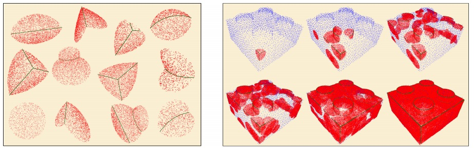

  
<b>Surface reconstruction with local shape priors.</b> Left: some examples of the local shape priors defining the context
for reconstructing the Lego model. Right: the augmentation process finds shape priors matching local neighborhoods in the
scan, aligns them, and places them in the scan. As a consequence, the scan is augmented with noiseless samples, quality normal
information, and sharp feature classifications (green points).

### Abstract
We present an example-based surface reconstruction method for scanned point sets. Our approach uses a database of local shape priors built from a set of given context models that are chosen specifically to match a specific scan. Local neighborhoods of the input scan are matched with enriched patches of these models at multiple scales. Hence, instead of using a single prior for reconstruction, our method allows specific regions in the scan to match the most relevant prior that fits best. Such high confidence matches carry relevant information from the prior models to the scan, including normal data and feature classification, and are used to augment the input point-set. This allows to resolve many ambiguities and difficulties that come up during reconstruction, e.g., distinguishing between signal and noise or between gaps in the data and boundaries of the model. We demonstrate how our algorithm, given suitable prior models, successfully handles noisy and under-sampled point sets, faithfully reconstructing smooth regions as well as sharp features.

[Download paper here](../projects/srl/2007_SRL.pdf)
