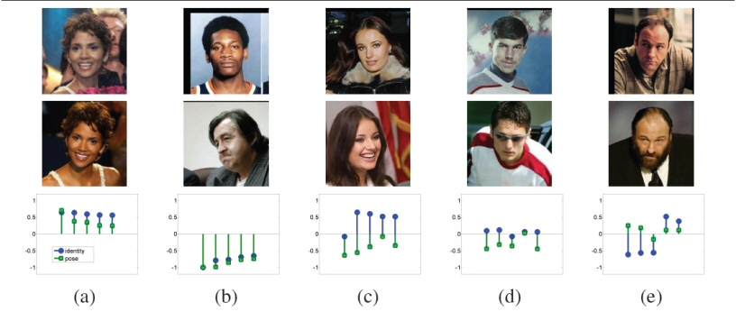
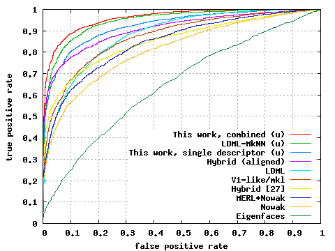

### Abstract
The One-Shot Similarity measure has recently been introduced as a means of boosting the performance of face recognition systems. Given two vectors, their One-Shot Similarity score reflects the likelihood of each vector belonging to the same class as the other vector and not in a class defined by a fixed set of “negative” examples. An appealing aspect of this approach is that it does not require class labeled training data. In this paper we explore how the One-Shot Similarity may nevertheless benefit from the availability of such labels. We make the following contributions: (a) we present a system utilizing subject and pose information to improve facial image pair-matching performance using multiple One-Shot scores; (b) we show how separating pose and identity may lead to better face recognition rates in unconstrained, “wild” facial images; (c) we explore how far we can get using a single descriptor with different similarity tests as opposed to the popular multiple descriptor approaches; and (d) we demonstrate the benefit of learned metrics for improved One-Shot performance. We test the performance of our system on the challenging Labeled Faces in the Wild unrestricted benchmark and present results that exceed by a large margin results reported on the restricted benchmark.

[Data](../projects/lfwa/index.html)

[Download paper here](../projects/multishot/TWH_BMVC09_Multishot.pdf)

[BibTeX](../projects/multishot/BibTeX.txt)

### Related publications
[The One-Shot Similarity Kernal](./2009_ICCV)

[Descriptor Based Methods in the Wild](./2008_ECCV)

 
**Decoupling pose and identity with multiple One-Shot Similarity (OSS) scores:** Each group contains two images and 10 sample multiple OSS scores. Identity based multiple OSS scores are plotted with circle markers and pose based are with squares. As can be seen the value of each type of OSS score is a good indication of the type of similarity between the images of the pair. (a) Same person, same pose. (b) Different persons and pose. (c) Same person, different pose. (d) Different persons, same pose. (e) Same person and pose, however, a mode of variability not modeled in the system is present.
  
 
**Results on the LFW benchmark:** ROC curves averaged over 10 folds of View 2 of the LFW data set. Each point on the curve represents the average over the 10 folds of (false positive rate, true positive rate) for a fixed threshold. The proposed method (single and multiple descriptors) is compared to the best algorithms as reported on the [LFW results page](http://vis-www.cs.umass.edu/lfw/results.html). These algorithms include the combined Nowak+MERL \[14], the Nowak method \[20], the hybrid method of [27] and as well using our alignment technique (Section 4.1), the V1-like/MKL methodof \[24] and the recent LMDL/MkNN methods of \[11]. (u) indicates ROC curve is for the unrestricted setting.

