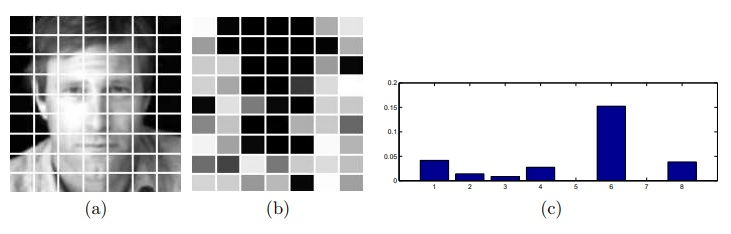

 
<b>The illustration of “grid” approach on the LFW data.</b> Each image is split into 63 blocks (a) and for each block 8 descriptors are computed. GridRVM assigns individual regularization coefficients for each block and each descriptor. The relevance of blocks (the darker the more informative) is shown in (b) and the relevance of descriptors (inverse regularization coefficient) is shown in (c).

### Abstract
We adopt the Relevance Vector Machine (RVM) framework to handle cases of tablestructured data such as image blocks and image descriptors. This is achieved by coupling the regularization coefficients of rows and columns of features. We present two variants of this new gridRVM framework, based on the way in which the regularization coefficients of the rows and columns are combined. Appropriate variational optimization algorithms are derived for inference within this framework. The consequent reduction in the number of parameters from the product of the table’s dimensions to the sum of its dimensions allows for better performance in the face of small training sets, resulting in improved resistance to overfitting, as well as providing better interpretation of results. These properties are demonstrated on synthetic data-sets as well as on a modern and challenging visual identification benchmark.

[Download paper here](../projects/rvm/gridRVM.pdf)
