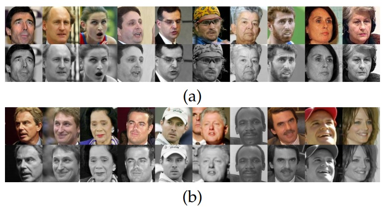

 
<b>Partitioning into pose.</b> (a) Images in the same pose bin. (b) One example from each pose bin ordered by value. In each subfigure the top row contains the original images and the bottom row contains the aligned versions. 

### Abstract
Computer Vision and Biometrics systems have demonstrated considerable improvement in recognizing and verifying faces in digital images. Still, recognizing faces appearing in unconstrained, natural conditions remains a challenging task. In this paper we present a face-image, pair-matching approach primarily developed and tested on the “Labeled Faces in the Wild” (LFW) benchmark that reflect the challenges of face recognition from unconstrained images. The approach we propose makes the following contributions. (a) We present a family of novel face-image descriptors designed to capture statistics of local patch similarities. (b) We demonstrate how semi-labeled background samples may be used to better evaluate image similarities. To this end we describe a number of novel, effective similarity measures. (c) We show how labeled background samples, when available, may further improve classification performance, by employing a unique pair-matching pipeline. We present state-of-the-art results on the LFW pair-matching benchmarks. In addition, we show our system to be well suited for multi-label face classification (recognition) problems. We perform recognition tests on LFW images as well images from the laboratory controlled multiPIE database.

[Data](../projects/lfwa/index.html)

[Download paper here](../projects/eufr/WolfHassnerTaigman_TPAMI2011.pdf)

