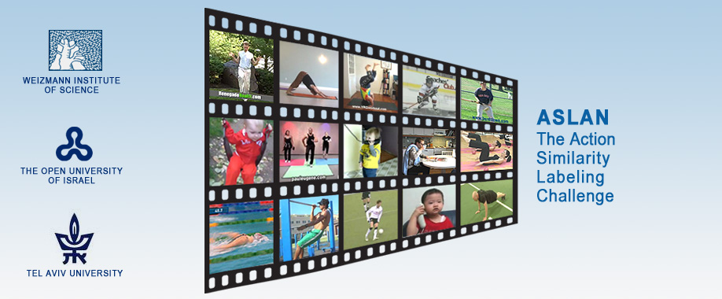

### Abstract
Recognizing actions in videos is rapidly becoming a topic of much research. To facilitate the development of methods for action recognition, several video collections, along with benchmark protocols, have previously been proposed. In this paper, we present a novel video database, the “Action Similarity LAbeliNg” (ASLAN) database, along with benchmark protocols. The ASLAN set includes thousands of videos collected from the web, in over 400 complex action classes. Our benchmark protocols focus on action similarity (same/not-same), rather than action classification, and testing is performed on never-before-seen actions. We propose this data set and benchmark as a means for gaining a more principled understanding of what makes actions different or similar, rather than learning the properties of particular action classes. We present baseline results on our benchmark, and compare them to human performance. To promote further study of action similarity techniques, we make the ASLAN database, benchmarks, and descriptor encodings publicly available to the research community.

[Database](../projects/ASLAN-main.html)

[Download paper here](../projects/ASLAN/ActionSimilarityLabelingChallenge_TPAMI_2012.pdf)
