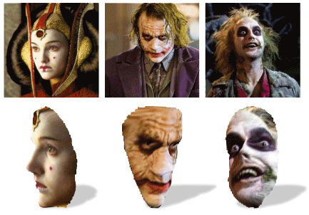

### Abstract
We present a data-driven method for estimating the 3D shapes of faces viewed in single, unconstrained photos (aka “in-the-wild”). Our method was designed with an emphasis on robustness and efficiency – with the explicit goal of deployment in real-world applications which reconstruct and display faces in 3D. Our key observation is that for many practical applications, warping the shape of a reference face to match the appearance of a query, is enough to produce realistic impressions of the query’s 3D shape. Doing so, however, requires matching visual features between the (possibly very different) query and reference images, while ensuring that a plausible face shape is produced. To this end, we describe an optimization process which seeks to maximize the similarity of appearances and depths, jointly, to those of a reference model. We describe our system for monocular face shape reconstruction and present both qualitative and quantitative experiments, comparing our method against alternative systems, and demonstrating its capabilities. Finally, as a testament to its suitability for real-world applications, we offer an open, online implementation of our system, providing unique means of instant 3D viewing of faces appearing in web photos.

[Download paper here](../projects/ViewFaces3D/HassnerICCV2013.pdf)

[BibTeX](../projects/ViewFaces3D/BibTeX.txt)

### What's New
- <b>3-May-2015:</b> Please see followup project on [face frontalization](./2015_CVPR_1) for code and data.
- <b>28-Oct-2013:</b> We've now made the code used for face pose adjustments [available online!](./2014_MVAP) This includes functions for rendering standard 3D, CG files directly from MATLAB, along with depths and 3D coordinates.
