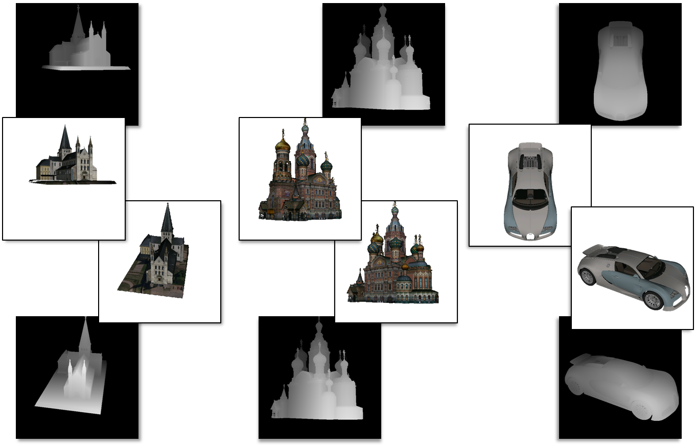

 
Examples of 3D models from the google 3D warehouse, rendered in MATLAB along with their (inverse) depth-maps, using the MATLAB 3D renderer.

### Abstract
The same scene can be depicted by multiple visual-media. For example, the same event can be captured by a comic image or a movie frame; the same object can be represented by a photograph or by a 3D computer graphics model. In order to extract the visual analogies that are at the heart of cross media analysis, spatial matching is required. This matching is commonly achieved by extracting key-points, and scoring multiple, randomly generated mapping hypotheses. The more consensus a hypothesis can draw, the higher its score. 
In this paper we go beyond the conventional setsize measure for the quality of a match and present a more general hypothesis score that attempts to reflect how likely is each hypothesized transformation to be the correct one for the matching task at hand. This is achieved by considering additional, contextual cues for the relevance of a hypothesized transformation. This context changes from one matching task to another and reflects different properties of the match, beyond the size of a consensus set. We demonstrate that by learning how to correctly score each hypothesis based on these features we are able to deal much more robustly with the challenges required to allow cross media analysis, leading to correct matches where conventional methods fail.

[Springer](https://link.springer.com/article/10.1007%2Fs00138-013-0571-4)

[Download paper here](../projects/MVAP13/HasserAssifWolf_MVAP13.pdf)

### MATLAB 3D Model Renderer - What is this?
MATLAB function for rendering textured 3D models and computing object 6dof pose

MATLAB functions which use [OpenSceneGraph](http://www.openscenegraph.org/) and [OpenCV](http://opencv.org/) for the following:
- Reading standard 3D CG file formats into MATLAB (.wrl, .obj, .3ds, etc.)
- Rendering with camera control using sphere orientation (elevation , azimuth, and yaw) or camera matrix
- Results rendered <u>off-screen</u> and returned as MATLAB matrices. It is therefore suitable for console versions of MATLAB, as well as batch processing of many views / models
- Outputs depth map (inverse depth at each pixel) along with rendered views; can be used with the MATLAB 'surf' function.
- Outputs an 'unproject' matrix, linking each pixel with the coordinates the 3D surface point projected onto that pixel; it is therefore ideal for calibration / pose estimation using a 3D model as reference.
- Along with the 'calib' function, can be used to compute pose from 2D-3D correspondences, and pose-adjust models to images (see below)
3D model caching - repeated rendering of the same model automatically use cached data and do not involve re-loading / reading the CG file

This code was developed by [Liav Assif](liav.assif@gmail.com) and [Tal Hassner](../) and was used in the following papers:
- Tal Hassner, Shai Harel*, Eran Paz* and Roee Enbar, Effective Face Frontalization in Unconstrained Images, IEEE Conf. on Computer Vision and Pattern Recognition (CVPR), Boston, June 2015 ([Project and code](./2015_CVPR_1), [arXiv](http://arxiv.org/abs/1411.7964), [PDF](http://arxiv.org/pdf/1411.7964v1.pdf))
\* These author names are in alphabetical order due to equal contribution.
- [Tal Hassner](../), Viewing Real-World Faces in 3D, International Conference on Computer Vision (ICCV), Sydney, Austraila, Dec. 2013 ([Project](./2013_ICCV), [PDF](../projects/ViewFaces3D/HassnerICCV2013preprint.pdf))
- [Tal Hassner](../), [Liav Assif](liav.assif@gmail.com), and [Lior Wolf](http://www.cs.tau.ac.il/~wolf/), When Standard RANSAC is Not Enough: Cross-Media Visual Matching with Hypothesis Relevancy, Machine Vision and Applications (MVAP), Volume 25, Issue 4, Page 971-983, 2014 ([PDF](../projects/RANSAC/HasserAssifWolfMVAP13.pdf))

If you find this code useful, please add suitable references in your work to any (or all) of these papers.  

### Downloads
The following files are available for download:
- [renderer-1.0.2.tar.gz](../projects/poses/renderer-1.0.2.tar.gz) Linux version of the renderer function (see [readme](../projects/poses/readme.txt) for install details, FAQ and more)
- [calib.1.0.1.zip](../projects/poses/calib.1.0.1.zip), a MATLAB wrapper for the OpenCV calibration function, used with renderer to adjust the pose of the model rendered using renderer. (see [readme](../projects/poses/readme.txt) for install details, FAQ and more). This is the Linux version, in order to use on Windows, see below for the Windows, OpenCV binaries.
- To help newcomers, we provide pre-compiled versions of the dependent libraries, OpenSceneGraph and Mesa OpenGL in [renderer-pre-compiled-libs.0.0.2.tar.gz](../projects/poses/renderer-pre-compiled-libs.0.0.2.tar.gz) (~58MB).
- OpenCV binaries for calib on Windows are also available, in [opencv_lib.zip](../projects/poses/opencv_lib.zip) and [opencv_bin.zip](../projects/poses/opencv_bin.zip). To use these, unpack to two separate folders and add these folders to the system PATH before running MATLAB.
- An unofficial (and unsupported) OSX port is at [bitbucket.org](https://bitbucket.org/yhacohen/matlab-renderer/), with special thanks to <b>Yoav HaCohen</b>.
- <b>Elad Shtivi's</b> code and <b>Windows binaries</b> for the real-time demo, including facial animation (see videos below) is now available from [github](https://github.com/eshtivi/Poses).
- An unofficial (and unsupported) <b>Windows port for renderer, with special thanks to Chao Yao:</b> [renderer.Windows.1.0.0.zip](../projects/poses/renderer.Windows.1.0.0.zip). See [readme.windows.1.0.0.txt](../projects/poses/readme.windows.1.0.0.txt) for further details. For questions or concerns regarding this Windows version, please contact [Chao Yao](leonhartyao@gmail.com).

### What's new 
- <b>14-April-2015:</b> Updated version for the Linux version of renderer; now supports MATLAB 2014b and includes changes to the documentation (previous version available below).
- <b>8-February-2015:</b> Chao Yao has generously provided <b>pre-compiled Windows binaries for the renderer function</b>, along with source files, modified for easy compilation on different Windows platforms / MATLAB versions. Code is available in renderer.Windows.1.0.0.zip. Please see readme.windows.1.0.0.txt for additional information.  
- <b>1-December-2014:</b> Face frontalization project is now online, including MATLAB code for synthesizing front-facing views of faces in unconstrained images. This project utilizes the calib function as well as data produced by the renderer function (though renderer is not required for frontalization). 
- <b>30-November-2014:</b> Added <b>Windows</b> pre-compiled <b>calib</b> mex file, as well as OpenCV Windows binaries. 
- <b>15-September-2014: Elad Shtivi's</b> Windows code and binaries for the real-time demo of renderer and calib, including facial animations, is now online from github. Videos demonstrating some of its capabilities are available on Youtube:

<iframe width="560" height="315" src="https://www.youtube.com/embed/8-_kW3XITkQ" frameborder="0" allow="autoplay; encrypted-media" allowfullscreen></iframe> 

<iframe width="560" height="315" src="https://www.youtube.com/embed/OvaCBEHa0LE" frameborder="0" allow="autoplay; encrypted-media" allowfullscreen></iframe>

- <b>28-August-2014:</b> Some basic capabilities of the calib+renderer combo, including the addition of facial animation, are demonstrated by <b>Elad Shtivi</b> in the following video.
- <b>17-August-2014:</b>
  - calib-1.0.0. Added OpenCV 2.4 support. Documentation and example update.
  - renderer-1.0.1. Added demo.m, with many examples.
  - FAQ update with solutions to additional issues.
  - Added compile_renderer.m and compile_calib.m functions to help build functions on additional machines. 
- <b>16-July-2014:</b> Added link to [OSX port](https://bitbucket.org/yhacohen/matlab-renderer/).
- <b>13-July-2014:</b> Updated renderer code with some bug fixes. New [READMErenderer.txt](../projects/poses/READMErenderer.txt) with more information, quick start guide, FAQ and more. Example public domain wrl file now included in the package.
- <b>17-March-2014:</b> Pre-complied dependent libraries file now also contains the [Coin3D](http://www.coin3d.org/) library, required by OpenSceneGraph to support some 3D formats. This addition is quite large; the previous version of the pre-compiled libraries file can still be downloaded below, in case Coin3D is not required. 
- <b>1-March-2014:</b> calib version 0.0.2 containes a few fixes and missing files
- <b>23-December-2013:</b>
  - Renderer code no longer depends on OpenCV
  - Pre-compiled dependent libraries are now available.

### Previous versions
- April    2015: [renderer-1.0.1.tar.gz](../projects/poses/renderer-1.0.1.tar.gz)
- November 2014: [calib-1.0.0.tar.gz](../projects/poses/calib-1.0.0.tar.gz)
- August   2014: [calib.0.0.2.zip](../projects/poses/calib.0.0.2.zip) , [renderer.1.0.0.zip](../projects/poses/renderer.1.0.0.zip)
- July     2014: [renderer.0.0.2.zip](../projects/poses/renderer.0.0.2.zip)
- March    2014: [renderer-pre-compiled-libs.tar.gz](../projects/poses/renderer-pre-compiled-libs.tar.gz)
- December 2013: [calib.0.0.1.zip](../projects/poses/calib.0.0.1.zip)
- November 2013: [renderer.0.0.1.zip](../projects/poses/renderer.0.0.1.zip)

### Example usage
See quickstart section in [READMErenderer.txt](../projects/poses/READMErenderer.txt) for installation instructions. In case of any problems, please see the FAQ, also in [READMErenderer.txt](../projects/poses/READMErenderer.txt). 

Example taken from [Hassner, ICCV'13](./2013_ICCV): Rendering a 3D face model to match the pose of a face appearing in a query photo. Assuming that the code from www.ics.uci.edu/~xzhu/face/ is used for detecting facial features, and a textured 3D model of a face saved as file 'ref_model.obj'. 

<b><u>STEP 1 - RENDER 3D REFERENCE MODEL, DETECT SPECIFIC FACIAL FEATURES, GET THEIR 3D COORDINATES ON THE 3D MODEL</u></b> 
 <b>render</b> 

[refD, refI, refU, outA, outR, outT] = renderer(render_width, render_height, 'ref_model.obj', 0, 1, 1, 0, 0, 0, 'zxy');

  
 <b>detect facial features on the rendered image</b>, code from [www.ics.uci.edu/~xzhu/face/](www.ics.uci.edu/~xzhu/face/) with modifications to get center of detection window (detect parameters taken from their code) 

ref_bs = detect(refI, model, model.thresh); 
ref_bs = clipboxes(refI, ref_bs); 
ref_bs = nms_face(ref_bs,0.3); 
x1 = ref_bs.xy(:,1); 
y1 = ref_bs.xy(:,2); 
x2 = ref_bs.xy(:,3); 
y2 = ref_bs.xy(:,4); 
ref_XY = [(x1+x2)/2,(y1+y2)/2];

 <b>get 3D coordinates of facial features, using the refU map from image 2D to model 3D</b> 

ind = sub2ind([size(refU,1), size(refU,2)], round(ref_XY(:,2)), round(ref_XY(:,1))); 
threedee = zeros(numel(ind),3); 
tmp = refU(:,:,1); 
threedee(:,1) = tmp(ind); 
tmp = refU(:,:,2); 
threedee(:,2) = tmp(ind); 
tmp = refU(:,:,3); 
threedee(:,3) = tmp(ind); 
% a bit of sanity 
indbad = find(max(threedee,[],2)==0); 
threedee(indbad,:)=[];  
  

<b><u>STEP 2 - LOAD QUERY IMAGE, DETECT ITS FACIAL FEATURES</u></b> 

queryI = imread(filen); 
img_bs = detect(queryI, model, model.thresh); 
img_bs = clipboxes(queryI, img_bs); 
img_bs = nms_face(img_bs,0.3); 
x1 = img_bs.xy(:,1); 
y1 = img_bs.xy(:,2); 
x2 = img_bs.xy(:,3); 
y2 = img_bs.xy(:,4); 
img_XY = [(x1+x2)/2,(y1+y2)/2]; 
img_XY(indbad,:)=[];  

<b><u>STEP 3 - COMPUTE POSE USING REFERENCE 3D POINTS + QUERY 2D POINTS, AND RE-RENDER</u></b> 
 <b>Estimate pose</b> 

[est_A,est_R,est_T]=doCalib(size(refU,2),size(refU,1),img_XY,threedee,outA,[],[]);
  
  
 <b>re-render reference to the same pose as query.</b> Note the change in input and output parameters vs. the previous call. Also note that the model file is not reloaded and a cached version is used instead. 

[refD, refI, unproject_est] = renderer(render_width, render_height, 'ref_model.obj', 0, 1, est_A, est_R, est_T);  

 

<table>
  <tr>
    <td></td>
    <td></td>
    <td></td>
  </tr>
  <tr>
    <td>(a) A query photo (from the <a href="http://vis-www.cs.umass.edu/lfw/">LFW</a> collection)</td>
    <td>(b) <a href="http://www.ics.uci.edu/~xzhu/face/">Facial feature detection</a> on the query and the rendered reference in frontal pose</td>
    <td>(c) Output, pose adjusted reference, along with depth-map</td>
  </tr>  
</table>

<b>Illustrating the example code above.</b> Using a reference 3D model from the USF. DARPA Human-ID 3D Face Database. Detected features on the query image (red points), are matched to the same detections on the reference image (yellow points). The 'unproject' matrix refU is then used to provide each 2D point on the reference image, its corresponding 3D point on the 3D reference model, in the model coordinate system. From these 2D-3D correspondences, a camera matrix is obtained and renderer used again to render a pose adjusted reference image and corresponding depth map.

 <b>Copyright and disclaimer</b>
 Copyright 2013, Liav Assif and Tal Hassner
