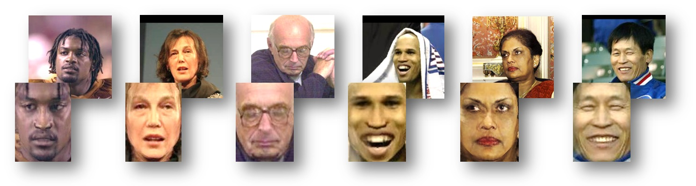

 [Camera ready](../projects/frontalize/frontalize.pdf)
 [Extended abstract](../projects/frontalize/frontalize_abstract.pdf)
 [CVPR poster](../projects/frontalize/hassner_et_al_cvpr15_poster.pdf)
 [arXiv](https://arxiv.org/abs/1411.7964) preprint PDF (early arXiv preprint arXiv:1411.7964, 28 Nov. 2014)
 [BibTeX](../projects/frontalize/BibTeX.txt)

 
 <b>Figure 1.</b> Frontalized faces. Top: Input photos; bottom: our frontalizations, obtained without estimating 3D facial shapes.

### Abstract
“Frontalization” is the process of synthesizing frontal facing views of faces appearing in single unconstrained photos. Recent reports have suggested that this process may substantially boost the performance of face recognition systems. This, by transforming the challenging problem of recognizing faces viewed from unconstrained viewpoints to the easier problem of recognizing faces in constrained, forward facing poses. Previous frontalization methods did this by attempting to approximate 3D facial shapes for each query image. We observe that 3D face shape estimation from unconstrained photos may be a harder problem than frontalization and can potentially introduce facial misalignments. Instead, we explore the simpler approach of using a single, unmodified, 3D surface as an approximation to the shape of all input faces. We show that this leads to a straightforward, efficient and easy to implement method for frontalization. More importantly, it produces aesthetic new frontal views and is surprisingly effective when used for face recognition and gender estimation.

### Downloads
  1. <b>Frontalization code:</b> Our MATLAB implementation of the method described in the paper is available on the FTP in the file frontalization.0.1.3.zip. Please see the [README.txt](../projects/frontalize/README.txt) for details on how to install and run the code. Though our code is written entirely in MATLAB, it has a few dependencies, including the [calib function](../projects/poses/project.html) and a facial feature detector. See the README.txt for further details.
The <b>entire frontalization project</b> was independently <b>ported to Python</b> by [Douglas Souza](mailto:douglas.souza.002@acad.pucrs.br). This useful port is available directly from his [github page](https://github.com/dougsouza/face-frontalization). This port uses the [DLIB facial feature detector](http://blog.dlib.net/2014/08/real-time-face-pose-estimation.html). <b>Thank you Douglas!</b>
[Yuval Nirkin](https://github.com/YuvalNirkin) has provided a [MATLAB wrapper for the DLIB face and facial landmark detector](https://github.com/YuvalNirkin/find_face_landmarks) used with the frontalization code. <b>Thank you, Yuval! </b>

2. <b>LFW3D:</b> The entire [LFW collection](http://vis-www.cs.umass.edu/lfw/), frontalized and stored in the same directory structure as the original LFW, is available on the FTP in the file LFW3D.0.1.1.zip.  

3. <b>Adience3D:</b> The entire [Adience image collection](https://www.openu.ac.il/home/hassner/Adience/data.html#agegender), frontalized and stored in the same directory structure as the original Adience collection, is available on the FTP in the file Adience3D.0.1.1.zip.
Images in the above sets were frontalized using the SDM facial feature detector ([Intraface](http://www.humansensing.cs.cmu.edu/intraface/)). Though we have found SDM to provide the best results, alternative detectors can easily be used with our code in its stead and we offer a number of other options. Please see documentation in the [README.txt](../projects/frontalize/README.txt) and the MATLAB functions themselves. 

Note that we are continuing to improve the quality of the frontalized images, and may post updates to both these collections (hence the version numbers on both files).

### What's new
- <b>June, 6th 2017</b>
Please see our [followup project on face recognition](./2016_ECCV_1), with more details on rendering and new Python code supporting more rendered views.

- <b>March, 21st 2016</b>
To help run frontalization on MATLAB, [Yuval Nirkin](https://github.com/YuvalNirkin) has provided a [MATLAB MEX for detecting faces and facial landmarks](https://github.com/YuvalNirkin/find_face_landmarks) using the DLIB library.

- <b>March, 21st 2016</b>
Added [a link](https://github.com/dougsouza/face-frontalization) to Python port of the frontalization project, contributed by [Douglas Souza](douglas.souza.002@acad.pucrs.br). 

- <b>Dec., 8th 2015</b>
Demo now allows for frontalization with any standard sparse (five-point) landmark detection method such as the one described in our recent paper [here](http://arxiv.org/abs/1511.04031). Choosing this option in demo.m currently allows for manual five-point localization. 

- <b>May, 18th 2015</b>
frontalization.0.1.2 now includes example usage with the [DLIB facial feature detector](http://blog.dlib.net/2014/08/real-time-face-pose-estimation.html) (based on [Kazemi and Sullivan](http://www.cv-foundation.org/openaccess/content_cvpr_2014/papers/Kazemi_One_Millisecond_Face_2014_CVPR_paper.pdf), CVPR'14). We have found it to provide excellent performance, and so offer it as an alternative to the commercial [SDM detector](http://www.humansensing.cs.cmu.edu/intraface/download_functions_matlab.html) and the older detector by [Zhu and Ramanan](http://www.ics.uci.edu/~xzhu/face/). 

### Download Instructions
These resources are available on our FTP server: agas.openu.ac.il. Direct access to the download directory is available through http://www.cslab.openu.ac.il/download/. 

For the FTP user name and password, please provide the details below. We ask for these details so we can keep in touch in case we find any need for a critical update or in case we would organize a dedicated workshop, etc. When done, you will immediately be able to see the FTP user name. 

<form action="https://docs.google.com/forms/d/1E5AX7S6pbvNsl2S9hazsN75WN7f813JBzWQR-_2SmNI/formResponse" method="POST" id="ss-form" target="_self" onsubmit="">
  <ol role="list" class="ss-question-list" style="padding-left: 0">
    

      

        

          <label class="ss-q-item-label" for="entry_1779840249">
Your name
            <label for="itemView.getDomIdToLabel()" aria-label="(Required field)"></label>
            <input type="text" name="entry.1779840249" value="" class="ss-q-short" id="entry_1779840249" dir="auto" aria-label="Your name " aria-required="true" required="" title="">

          </label>
        

      

    

    

      

        

          <label class="ss-q-item-label" for="entry_301328552">
            
Your e-mail
              <label for="itemView.getDomIdToLabel()" aria-label="(Required field)"></label>
                <input type="text" name="entry.301328552" value="" class="ss-q-short" id="entry_301328552" dir="auto" aria-label="Your e-mail  " aria-required="true" required="" title="">

              </label>
            

          

        
        
      <input type="hidden" name="draftResponse" value="[,,&quot;-7148573684254473238&quot;]">
      <input type="hidden" name="pageHistory" value="0">
      <input type="hidden" name="fbzx" value="-7148573684254473238">
          

              <class="ss-form-entry goog-inline-block" id="navigation-buttons" dir="ltr">
        <input type="submit" name="submit" value="Submit" id="ss-submit">
      

    </ol>
  </form>
  
If you have problems accessing the files through the direct link above please use instead a dedicated FTP client, and connect to the server agas.openu.ac.il. Two free clients are FileZilla and WinSCP. 

### Other Related Papers / Projects / Code
- Iacopo Masi, Tal Hassner, Anh Tuan Tran, and Gerard Medioni, Rapid Synthesis of Massive Face Sets for Improved Face Recognition, IEEE International Conference on Automatic Face and Gesture Recognition (FG) Washington, DC, May, 2017 ([PDF](../projects/augmented_faces/Masietal2017rapid.pdf), [project and code](./2016_ECCV_1))

- Iacopo Masi*, Anh Tuan Tran*, Tal Hassner*, Jatuporn Toy Leksut and Gerard Medioni, Do We Really Need to Collect Millions of Faces for Effective Face Recognition? European Conference on Computer Vision (ECCV), Amsterdam, The Netherlands, Oct. 2016 ([PDF](../projects/augmented_faces/Masietal2016really.pdf), [project and code](./2016_ECCV_1))   <i>\* Denotes equal contribution.</i>

- Yue Wu*, Tal Hassner*, KangGeon Kim, Gerard Medioni and Prem Natarajan, Facial Landmark Detection with Tweaked Convolutional Neural Networks, arXiv preprint arXiv:1511.04031, 21 Mar. 2016 ([PDF](http://arxiv.org/abs/1511.04031), [project and code](./2018_TPAMI_2))  <i>\* Denotes joint first authorship / equal contribution</i>

- E. Eidinger, R. Enbar, and T. Hassner, Age and Gender Estimation of Unfiltered Faces, Transactions on Information Forensics and Security (IEEE-TIFS), special issue on Facial Biometrics in the Wild, Volume 9, Issue 12, pages 2170 - 2179, Dec. 2014 ([Project](./2014_IEEE_TIFS))

- T. Hassner, L. Assif, and L. Wolf, When Standard RANSAC is Not Enough: Cross-Media Visual Matching with Hypothesis Relevancy, Machine Vision and Applications (MVAP), Volume 25, Issue 4, Page 971-983, 2014 ([Project](./2014_MVAP), [Springer](https://link.springer.com/article/10.1007%2Fs00138-013-0571-4))

- T. Hassner, Viewing Real-World Faces in 3D, International Conference on Computer Vision (ICCV), Sydney, Austraila, Dec. 2013 ([Code, project, PDF](./2013_ICCV))

 
<b>Copyright and disclaimer</b>
 Copyright 2014, Tal Hassner

