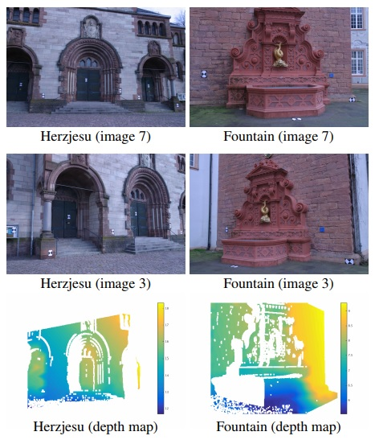

 
<b>Depth maps computed with our method</b>

### Abstract
Finding correspondences in wide baseline setups is a challenging problem. Existing approaches have focused largely on developing better feature descriptors for correspondence and on accurate recovery of epipolar line constraints. This paper focuses on the challenging problem of finding correspondences once approximate epipolar constraints are given. We introduce a novel method that integrates a deformation model. Specifically, we formulate the problem as finding the largest number of corresponding points related by a bounded distortion map that obeys the given epipolar constraints. We show that, while the set of bounded distortion maps is not convex, the subset of maps that obey the epipolar line constraints is convex, allowing us to introduce an efficient algorithm for matching. We further utilize a robust cost function for matching and employ majorization-minimization for its optimization. Our experiments indicate that our method finds significantly more accurate maps than existing approaches

[Download paper here](../projects/wbs/wbs-iccv2015.pdf)
