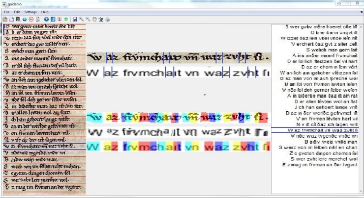

 
<b>A screen shot of our system</b>. The left pane is the image pane; the right pane contains the transcribed text. The middle pane is used to zoom in and interactively align a single line at a time. In this middle pane, the first two lines are used to edit anchor points.
Hovering over one of the anchor lines highlights the matching anchor in the other line. Anchors can be added, dragged, or removed. The other three lines in the middle pane depict the interpolated alignment: a line from the image, a line of warped synthesized text, and the line of synthesized text. 

### Abstract
We present an end-to-end system for aligning transcript letters to their coordinates in a manuscript image. An intuitive GUI and an automatic line detection method enable the user to perform an exact alignment of parts of document pages. In order to bridge large regions in between annotation, and augment the manual effort, the system employs an opticalflow engine for directly matching at the pixel level the image of a line of a historical text with a synthetic image created from the transcript’s matching line. Meanwhile, by accumulating aligned letters, and performing letter spotting, the system is able to bootstrap a rapid semi-automatic transcription of the remaining text. Thus, the amount of manual work is greatly diminished and the transcript alignment task becomes practical regardless of the corpus size.

[Download paper here](../projects/viralta/ICDAR2015_viralta.pdf)
