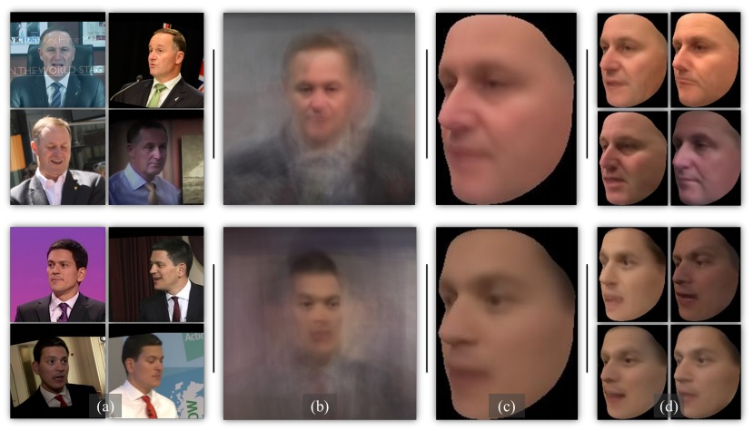

 
<b>Pooled faces.</b> (a) Example images from Janus templates. (b) Averages of all in-plane aligned template images. The subjects
are hardly recognizable in these averages. (c) Averages of all 3D aligned template images. Though better than (b), these are over smoothed
and still hard to recognize. (d) Averages of 3D aligned images from four different face bins. These retain more high frequency information
and details necessary for recognizing the subjects in the photos

### Abstract
We propose a novel approach to template based face recognition. Our dual goal is to both increase recognition accuracy and reduce the computational and storage costs of template matching. To do this, we leverage on an approach which was proven effective in many other domains, but, to our knowledge, never fully explored for face images: average pooling of face photos. We show how (and why!) the space of a template’s images can be partitioned and then pooled based on image quality and head pose and the effect this has on accuracy and template size. We perform extensive tests on the IJB-A and Janus CS2 template based face identification and verification benchmarks. These show that not only does our approach outperform published state of the art despite requiring far fewer cross template comparisons, but also, surprisingly, that image pooling performs on par with deep feature pooling.

[Download paper here](../projects/PoolingFaces/Hassner_CVPR_2016.pdf)
