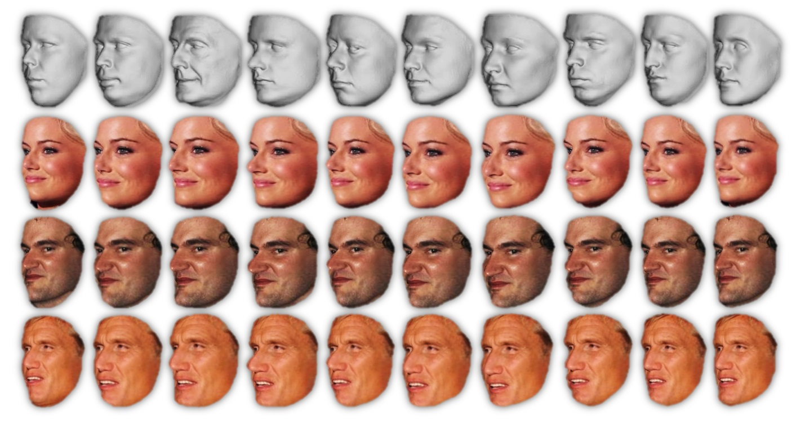

\* Denotes equal contribution. 

 
<b>Augmenting faces by using different generic 3D models for rendering</b>. Top: The ten generic 3D face shapes used for rendering. Bottom: Faces rendered with the generic appearing right above them. Different shapes induce subtle appearance variations yet do not change the perceived identity of the face in the image. A single face image is rendered using different generic 3D models, at different poses and different expressions (not shown here, see paper). This enriches the training set with important intra-subject appearance variations thereby substantially improving recognition rates.

### Abstract
Face recognition capabilities have recently made extraordinary leaps. Though this progress is at least partially due to ballooning
training set sizes – huge numbers of face images downloaded and labeled for identity – it is not clear if the formidable task of collecting so many images is truly necessary. We propose a far more accessible means of increasing training data sizes for face recognition systems: Domain specific data augmentation. We describe novel methods of enriching an existing dataset with important facial appearance variations by manipulating the faces it contains. This synthesis is also used when matching query images represented by standard convolutional neural networks. The effect of training and testing with synthesized images is tested on the LFW and IJB-A (verification and identification) benchmarks and Janus CS2. The performances obtained by our approach match state of the art results reported by systems trained on millions of downloaded images.

[Download paper here](../projects/augmented_faces/Masietal_ECCV2016.pdf)

[Older arXiv preprint](http://arxiv.org/abs/1603.07057)

[BibTeX](../projects/augmented_faces/BibTeX.txt)

 If you want to better understand how the rendering code works, and why a simple 10-line Python function renders faces faster than OpenGL, read our FG'17 paper: 
 Iacopo Masi, Tal Hassner, Anh Tuan Tran, and Gerard Medioni, Rapid Synthesis of Massive Face Sets for Improved Face Recognition, IEEE International Conference on Automatic Face and Gesture Recognition (FG) Washington, DC, May, 2017 ([PDF](../projects/augmented_faces/Masietal_2017.pdf), [BibTeX](../projects/augmented_faces/BibTeXFG.txt))

### Downloads
If you find the resources below useful, please reference our paper in your work.

1. Python, face specific augmentation code now [available on GitHub](https://github.com/iacopomasi/face_specific_augm).
The code can be used to synthesize new views of faces appearing in unconstrained images, to the three yaw angles (frontal / 0°, 40° and 75°) with the same ten generic 3D face shapes used in our ECCV'16 paper (see also figure at the top of this page). 
This code implements a different method than the one used for the ECCV'16 paper. The new method provides more functionality and the code is designed to provide an easy to use interface. Tests comparing the new rendering method with the one used for ECCV show the new approach to lead to better trained CNN models and higher recognition rates*. This code release, however, may still be unstable, so please use at your own risk!  
\* The new functionality and the additional tests comparing this new version to the one used for the ECCV paper are currently unpublished.

2. [ResFace-101 a ResNet-101 network for face recognition](https://goo.gl/3vygej), fined-tuned on CASIA images following the augmentation described in our paper.
This is a deep network trained to recognize faces appearing in extreme poses and viewing conditions. It was tested on the IJB-A benchmark and shown to provide results comparable to state of the art. This network was not used in the paper; we found the ResNet-101 to provide better performance than the network we previously used. Finally, augmentation used the new code available on this webpage (rather than the older function used in the paper).

This is an ongoing project and we are continually adding more features, data and information. Please check this page again for updates.

 <b>Copyright and disclaimer</b>
 Copyright 2016, Iacopo Masi, Anh Tuan Tran, Tal Hassner, Jatuporn Toy Leksut and Gerard Medioni 
