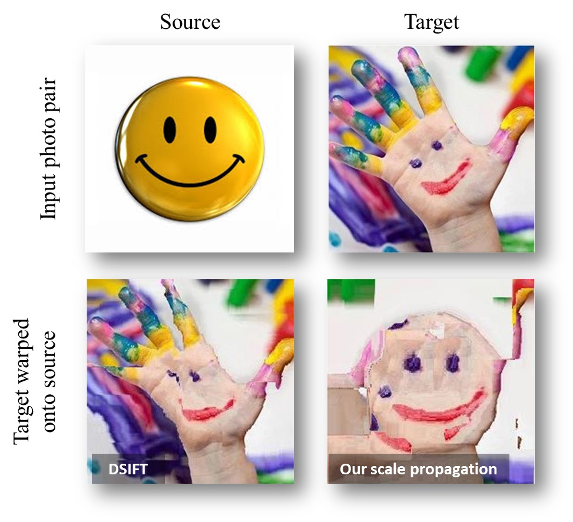

 
**Dense correspondences between the same semantic content ("smiley") in different scenes and different scales.** Top: Input images. Bottom: Results visualized by warping the colors of the "Target" photo onto the "Source" using the estimated correspondences from Source to Target. A good result has the colors of the Target photo, located in the same position as their matching semantic regions in the Source. Results show the output of the original SIFT-Flow method, using DSIFT without local scale selections (bottom left), and our method (bottom right).

### Abstract
We seek a practical method for establishing dense correspondences between two images with similar content, but possibly
different 3D scenes. One of the challenges in designing such a system is the local scale differences of objects appearing in the
two images. Previous methods often considered only few image pixels; matching only pixels for which stable scales may be reliably
estimated. Recently, others have considered dense correspondences, but with substantial costs associated with generating, storing and
matching scale invariant descriptors. Our work is motivated by the observation that pixels in the image have contexts – the pixels around
them – which may be exploited in order to reliably estimate local scales. We make the following contributions. (i) We show that scales
estimated in sparse interest points may be propagated to neighboring pixels where this information cannot be reliably determined.
Doing so allows scale invariant descriptors to be extracted anywhere in the image. (ii) We explore three means for propagating this
information: using the scales at detected interest points, using the underlying image information to guide scale propagation in each
image separately, and using both images together. Finally, (iii), we provide extensive qualitative and quantitative results, demonstrating
that scale propagation allows for accurate dense correspondences to be obtained even between very different images, with little
computational costs beyond those required by existing methods

[Download paper here (Full PAMI version)](../projects/scalemaps/TauHassner_TPAMI.pdf)

[Dowload paper here (Short arXiv preprint)](http://arxiv.org/pdf/1406.6323v1.pdf)

Video talk from the Dec. 21st, 2014, [IDC Israel Vision Day](http://cs.haifa.ac.il/~hagit/VisionDay/visionDay_2014.html)

### Downloads
- <b>Scale propagation code</b>: Our MATLAB implementation of the scale propagation method is [available here](../projects/scalemaps/scalemaps.0.0.1.zip). 
If you find this code useful, please cite our paper.

- <b>April 18, 2016</b> [Yuval Nirkin](https://github.com/YuvalNirkin) has shared a 3D reconstruction project which uses [OpenMVG](https://github.com/openMVG/openMVG/), [SIFT flow](http://people.csail.mit.edu/celiu/SIFTflow/) and our scale propagation method for 3D reconstruction from multiple views. In doing so, both [SIFT flow](http://people.csail.mit.edu/celiu/SIFTflow/) and our scale propagation methods were ported to OpenCV compatible code. 

- The 3D reconstruction code is available from a dedicated [github page](https://github.com/YuvalNirkin/DenseCorrespondences). 
- A pending OpenCV contribution with a port for SIFT flow and out scale propagation is available on the [OpenCV github](https://github.com/YuvalNirkin/opencv_contrib).

### Other Related Papers / Projects / Code
Tal Hassner, Viki Mayzels, and Lihi Zelnik-Manor, On SIFTs and their Scales, IEEE Conf. on Computer Vision and Pattern Recognition (CVPR), Rhode Island, June 2012 ([Project and Code](./2012_CVPR_1), [PDF](../projects/siftscales/OnSiftsAndTheirScales-CVPR12.pdf))

 <b>Copyright and disclaimer</b>
 Copyright 2014, Moria Tau and Tal Hassner 
