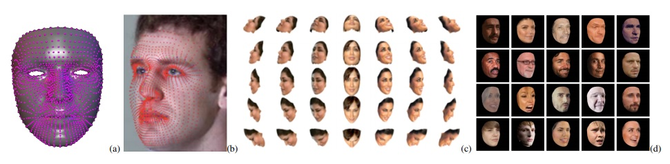

 
<b>Facial representation pipeline.</b> 

 
<b>Out-of-plane face alignment via rendering:</b> (a) reference generic 3D face shape; (b) face image with estimated 3D face shape; (c)
rendered face at different yaw-and-pitch grids; (d) aligned faces at yaw 45◦ and pitch-0◦. 

### Abstarct
We introduce our method and system for face recognition using multiple pose-aware deep learning models. In our representation, a face image is processed by several posespecific deep convolutional neural network (CNN) models to generate multiple pose-specific features. 3D rendering is used to generate multiple face poses from the input image. Sensitivity of the recognition system to pose variations is reduced since we use an ensemble of pose-specific CNN features. The paper presents extensive experimental results on the effect of landmark detection, CNN layer selection and pose model selection on the performance of the recognition pipeline. Our novel representation achieves better results than the state-of-the-art on IARPA’s CS2 and NIST’s IJB-A in both verification and identification (i.e. search) tasks. 

[Download paper here](../projects/DeepMultiPos/WACV2016.pdf)
