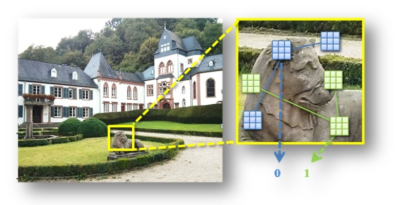

 
<b>Figure 1. Visualization of the LATCH descriptor</b>. Given an image patch centered around a keypoint, LATCH compares the intensity of three pixel patches in order to produce a single bit in the final binary string representing the patch. Example triplets are drawn over the patch in green and blue.

### Abstract
We present a novel means of describing local image appearances using binary strings. Binary descriptors have drawn increasing interest in recent years due to their speed and low memory footprint. A known shortcoming of these representations is their inferior performance compared to larger, histogram based descriptors such as the SIFT. Our goal is to close this performance gap while maintaining the benefits attributed to binary representations. To this end we propose the Learned Arrangements of Three Patch Codes descriptors, or LATCH. Our key observation is that existing binary descriptors are at an increased risk from noise and local appearance variations. This, as they compare the values of pixel pairs: changes to either of the pixels can easily lead to changes in descriptor values and compromise their performance. In order to provide more robustness, we instead propose a novel means of comparing pixel patches. This ostensibly small change, requires a substantial redesign of the descriptors themselves and how they are produced. Our resulting LATCH representation is rigorously compared to state-of-the-art binary descriptors and shown to provide far better performance for similar computation and space requirements.

[Download paper here](../projects/LATCH/LATCH.pdf)

### What is LATCH?
LATCH is a fast and compact binary descriptor used to represent local image regions. LATCH was shown to obtain better performance on standard benchmarks than other pure binary descriptors, sometimes matching the accuracy of far larger floating point representations such as SIFT. Its extraction time is only slightly longer than other binary descriptors and far faster than floating point representations. See the LATCH paper below for further details.

LATCH is now part of the OpenCV [xfeatures2d](https://github.com/Itseez/opencv_contrib/tree/master/modules/xfeatures2d) library, since version 3.0. 

LATCH won the CVPR 2015, [OpenCV State of the Art Vision Challenge](http://code.opencv.org/projects/opencv/wiki/VisionChallenge), in the Image Registration category. 

A video of the talk given by [Gil](https://gilscvblog.wordpress.com/) at WACV'16, describing LATCH:

<iframe width="560" height="315" src="https://www.youtube.com/embed/fvyd9aUJO9g" frameborder="0" allow="autoplay; encrypted-media" allowfullscreen></iframe>

### What is CLATCH?
Pronounced clutch, it is a CUDA port of the LATCH descriptor to the GPU. It is an ongoing project maintained by [Christopher Parker](csparker.work@gmail.com), Matthew Daiter and Kareem Omar. CLATCH is an extremely fast local descriptor. In fact, to our knowledge, it is presently the fastest available local binary descriptor. See the CLATCH paper for runtime comparisons.

### What are LATCH/CLATCH used for?
They can be used as alternatives to other local image descriptors, such as SIFT, SURF and ORB. In particular, CLATCH was [integrated into the OpenMVG](https://github.com/mdaiter/openMVG) Structure from Motion (SfM) library and used to produce extremely fast, detailed 3D reconstructions from high resolution photos. 

### Relevant references
- Christopher Parker, Matthew Daiter, Kareem Omar, Gil Levi and Tal Hassner, The CUDA LATCH Binary Descriptor: Because Sometimes Faster Means Better, Workshop on Local Features: State of the art, open problems and performance evaluation, at the European Conference on Computer Vision (ECCV), Amsterdam, The Netherlands, Oct. 2016 ([PDF](../projects/LATCH/CLATCH.pdf), [BibTeX](../projects/LATCH/BibTeXCLATCH.txt))

- Gil Levi and Tal Hassner, LATCH: Learned Arrangements of Three Patch Codes, IEEE Winter Conference on Applications of Computer Vision (WACV), Lake Placid, NY, USA, March, 2016 ([PDF](../projects/LATCH/LATCH.pdf), [BibTeX](../projects/LATCH/BibTeXLATCH.txt))

### Code and resources
- (CPU) **OpenCV LATCH**: The original [LATCH OpenCV implementation](https://github.com/Itseez/opencv_contrib/blob/master/modules/xfeatures2d/src/latch.cpp). It is part of the [xfeatures2d](https://github.com/Itseez/opencv_contrib/tree/master/modules/xfeatures2d) library. The full, merged pull request is [also available](https://github.com/Itseez/opencv_contrib/pull/231). Example usage of this version is available in [LATCH_match.cpp](https://github.com/Itseez/opencv/blob/master/samples/cpp/tutorial_code/xfeatures2D/LATCH_match.cpp).

- (CPU) **LATCH**: A new more [efficient reimplementation of LATCH](https://github.com/komrad36/LATCH). Our tests show it to run ~29 times faster than the original OpenCV implementation.

- (CPU) **ULATCH**: A *restricted*, [upright only version of LATCH](https://github.com/komrad36/ULATCH), (non rotationally invariant) descriptors. It is the fastest CPU implementation of LATCH making it well suited for feature tracking applications on the CPU. 

- (CUDA-GPU) **CLATCH**: Code for [CLATCH](https://github.com/komrad36/CLATCH), the CUDA LATCH GPU port.

- (CUDA-GPU) **UCLATCH**: A *restricted*, Upright [CLATCH](https://github.com/komrad36/UCLATCH), which reaches even faster speeds than CLATCH on the GPU by restricting descriptors to upright only.

- A [branch of the OpenMVG](https://github.com/mdaiter/openMVG), Structure from Motion library, which includes CLATCH to provide high speed 3D multi-view reconstructions. Also new to this branch is a GPU based, brute force Hamming distance matcher for binary descriptors.

If you find any of these resources useful, please be sure to cite the relevant papers above.

### The people involved in this project
In alphabetical order:
- Matthew Daiter
- [Tal Hassner](../)
- [Gil Levi](https://gilscvblog.com/)
- Kareem Omar
- [Christopher Parker](csparker.work@gmail.com)

 <b>Copyright and disclaimer</b>
 LATCH Copyright 2015, Gil Levi and Tal Hassner
 CLATCH copyright 2016, Christopher Parker, Matthew Daiter, Kareem Omar, Gil Levi and Tal Hassner 
