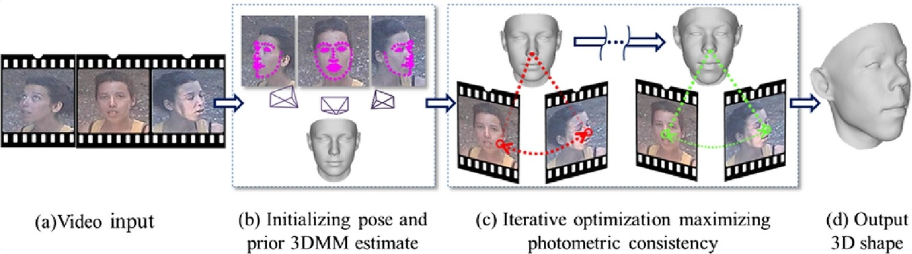

### Abstract
We propose a novel structure from motion (SfM) based method for reconstructing the 3D shapes of faces appearing in unconstrained videos. SfM techniques were studied since the early days of computer vision and their limitations are well known. In particular, they are unsuited for the low resolution scenes typical of videos of faces in the wild. To address this, we propose using a parametric face representation as a shape prior to constrain the estimated 3D face shape. Our proposed reconstruction method explores the space around the prior, modifying its 3D shape along with the estimated, per frame cameras and expressions in a manner designed to maximize photometric consistency across video frames yet produce face shapes. Our tests show that this process is both faster and provides superior 3D reconstruction accuracy when compared to existing alternatives.

[Download paper here](https://www.sciencedirect.com/science/article/pii/S0097849317300572)
