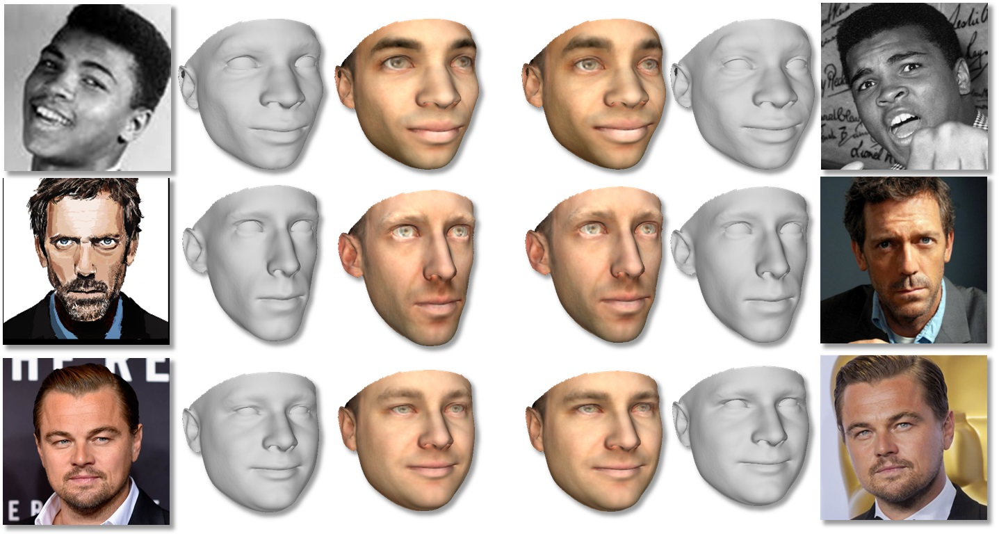

 
<b>Estimating a 3D Morphable Model (3DMM) with a very deep neural network.</b> Each row provides 3D shape and textures estimated for two images of the same subject. From left to right: Input image 1, estimated 3D shape 1, estimated 3D shape and texture 1, estimated 3D shape and texture 2, estimated 3D shape 2, Input image 2. Evidently, 3D shapes and textures estimated for different images of the the same subject are similar. 3D shapes and textures estimated for differtent subjects are different.

### Abstract
The 3D shapes of faces are well known to be discriminative. Yet despite this, they are rarely used for face recognition and always under controlled viewing conditions. We claim that this is a symptom of a serious but often overlooked problem with existing methods for single view 3D face reconstruction: when applied "in the wild", their 3D estimates are either unstable and change for different photos of the same subject or they are over-regularized and generic. In response, we describe a robust method for regressing discriminative 3D morphable face models (3DMM). We use a convolutional neural network (CNN) to regress 3DMM shape and texture parameters directly from an input photo. We overcome the shortage of training data required for this purpose by offering a method for generating huge numbers of labeled examples. The 3D estimates produced by our CNN surpass state of the art accuracy on the MICC data set. Coupled with a 3D-3D face matching pipeline, we show the first competitive face recognition results on the LFW, YTF and IJB-A benchmarks using 3D face shapes as representations, rather than the opaque deep feature vectors used by other modern systems.

[ArXiv preprint](https://arxiv.org/abs/1612.04904)

[BibTeX](../projects/CNN3DMM/BibTeX.txt)

### News
<b>Jan, 2017:</b> Demo code in Pyton is now available on our downloads section below. The code uses our deep network to estimate 3D shape and texture parameters of a face appearing in a single unconstrained photo. It produces a standard ply file output. If you've downloaded the network model in the past, we recommend that you do so again, as we've uploaded a slightly better model along with the code.

### FAQ
<b>Q: Will you release your network models and code?</b> 
A: Yes, and they are already online! Please see below. More code and results are being prepared.

 <b>Q: How do you convert the network output to a 3D representation?</b> 
A: The network output is a standard 3DMM representation. Please see our paper or [any other paper on 3DMMs](https://scholar.google.com/scholar?hl=en&q=3D+morphable+face+models) for instructions. Our distribution includes the data required to map the 3DMM parameters back to a textured 3D representation. Our demo code shows how to convert the network output to a standard textured mesh file (ply format) which can be viewed using standard 3D viewers (e.g., [MeshLab](http://www.meshlab.net/)). We are preparing a revision of our code with pose and expression estimation. This update will be available here soon.

 <b>Q: Why doesn't your network also model expression / pose / lighting / etc.?</b> 
A: This project aims to show that 3DMM parameters can be discriminative (different representations for different people) and robust (similar representations for the same person under varied viewing conditions). We therefore focused on parameters which reflect identity: 3D shape and texture. A possible next step is indeed to model more of these appearance variations. Note that pose and expression can be estimated directly from facial landmarks as demonstrated, e.g., in [this project](../projects/poses/project.html). We are preparing a revision of our code with pose and expression estimation. This update will be available here soon.

 <b>Q: Why do you say that your estimated 3DMM parameters are more robust and discriminative than those estimated by other methods?</b> 
A: We measured how well our 3D shape and texture parameters represent faces by estimating 3DMM parameters on an unprecedented number of photos in several challenging face recognition benchmarks. These include
- 13,233 images from [LFW](http://vis-www.cs.umass.edu/lfw/)
- 86,120 video frames from the [YTF](https://www.cs.tau.ac.il/~wolf/ytfaces/) set
- 24,472 video frames and images from the [IJB-A](https://www.nist.gov/itl/iad/image-group/ijba-dataset-request-form)
- 25,784 images and frames from the [MICC](http://www.micc.unifi.it/masi/research/ffd/) data set used to measure 3D reconstruction accuracy
- 500,000 images from [CASIA](http://www.cbsr.ia.ac.cn/english/CASIA-WebFace-Database.html) used to train our network
To our knowledge, this is the first evaluation of 3D face shape estimation methods performed at this scale and under such challenging conditions. These tests show our estimates to be substantially better in capturing subject specific shapes than the 3DMM estimates obtained by previous methods.

 <b>Q: Why are your face recognition results not as high as those reported by other face recognition systems?</b> 
A: Because this is not a face recognition system.
Specifically, we aim to show that our 3DMM estimates for different unconstrained photos of the same person are more similar to each other than to those of other subjects. We do this by testing our estimates on standard face recognition benchmarks. Our goal is therefore not to set new face recognition records, but to evaluate how robust and discriminative are our 3DMM estimates compared to those produced by previous methods. The results obtained with our estimated 3DMM shape and texture parameters are the highest we know of, and not much lower than recognition results obtained with state of the art face recognition systems using opaque features. 
But if you are interested in a recent state of the art face recognition method, please refer to our related, [face recognition project](./2016_ECCV_1).

 <b>Q: Does the network assume that faces are properly aligned / localized in order to produce a shape estimate?</b> 
A: In our tests, we used the bounding boxes provided in each data set as the only form of alignment (equivalent to aligning for spatial translation and scale). In particular, we do not require facial landmark detection to align the input face. Future versions of our code may use landmark detection only for pose and expression estimation.

 <b>Q: But your output is not aligned to the face in the image! How do you compute the 3D shape's pose?</b> 
A: The 6 degree of freedom pose of a 3D face is easy to compute, even for unconstrained images, using standard, off-the-shelf facial landmark detectors such as the one included in the [DLIB](http://blog.dlib.net/2014/08/real-time-face-pose-estimation.html) package. This was described in our [ICCV'13 paper](./2013_ICCV), MATLAB pseudo code for doing it is available in [this project webpage](../projects/poses/project.html) and the same method is effectively used in our [face frontalization](./2015_CVPR_1) and [face recognition](./2016_ECCV_1) projects (code available for both). 
Still, if you don't want to implement it yourself, we are planing to add this to our Python demo code soon.

 <b>Q: How did you get enough data, in particular many 3D face shapes, to train your network? </b> 
A: Read our paper!

### Downloads
If you find the resources below useful, please reference our paper in your work.

1. [ResNet-101 deep network for regressing 3DMM shape and texture parameters](https://goo.gl/8OnQKx)
This is a deep network trained to estimate 3DMM parameters for shape and texture from faces appearing in extreme poses and viewing conditions. The download contains all network parameters and the parameters required to map the network's output 3DMM features back to 3D and texture representations. Please see our paper for instructions on this process.

2. [Python code for estimating a textured 3D shape using our deep neural network](https://github.com/anhttran/3dmm_cnn)
An end-to-end demo code that estimates 3D facial shape and texture directly from an unconstrained 2D face image. For a given input image, it produces a standard textured 3D mesh file of the face (in ply format). It accompanies the deep network available above and both are required in order to run the demo.

This is an ongoing project and we are continually adding more features, data and information. Please check this page again for updates.

 <b>Copyright and disclaimer</b> 
Copyright 2017, Anh Tuan Tran, Tal Hassner, Iacopo Masi, and Gerard Medioni 
