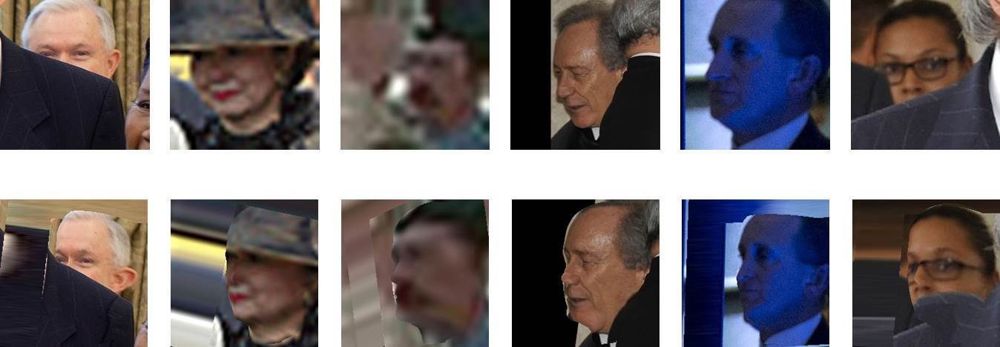

 
<b>Extreme face alignment examples:</b> Faces rendered to a 45 degrees yaw angle (aligned to half profile) using our FacePoseNet. Images were taken from the IJB-A collection and represent extreme viewing conditions, including near profile views, occlusions, and low resolution. Such conditions are often too hard for existing face landmark detection methods to handle yet easily aligned with our FacePoseNet. 

### Abstract
We show how a simple convolutional neural network (CNN) can be trained to accurately and robustly regress 6 degrees of freedom (6DoF) 3D head pose, directly from image intensities. We further explain how this FacePoseNet (FPN) can be used to align faces in 2D and 3D as an alternative to explicit facial landmark detection for these tasks. We claim that in many cases the standard means of measuring landmark detector accuracy can be misleading when comparing different face alignments. Instead, we compare our FPN with existing methods by evaluating how they affect face recognition accuracy on the IJB-A and IJB-B benchmarks: using the same recognition pipeline, but varying the face alignment method. Our results show that (a) better landmark detection accuracy measured on the 300W benchmark does not necessarily imply better face recognition accuracy. (b) Our FPN provides superior 2D and 3D face alignment on both benchmarks. Finally, (c), FPN aligns faces at a small fraction of the computational cost of comparably accurate landmark detectors. For many purposes, FPN is thus a far faster and far more accurate face alignment method than using facial landmark detectors.

[Code](https://github.com/fengju514/Face-Pose-Net)

[arXiv preprint](https://arxiv.org/pdf/1708.07517.pdf)
