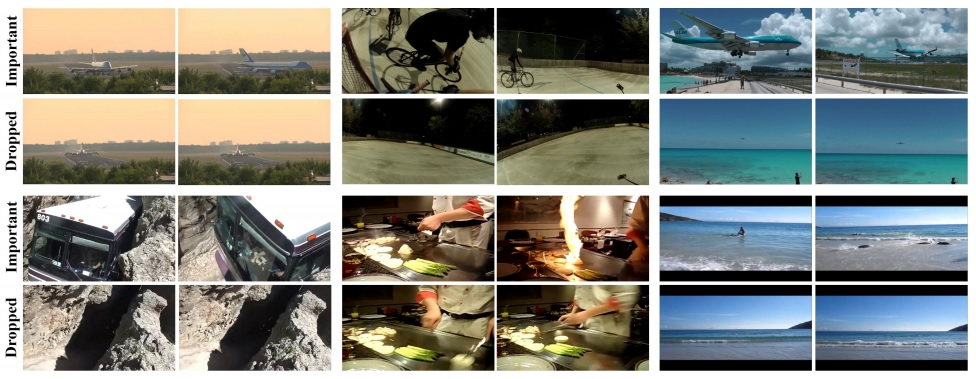

 
<b>Sample video summarization results.</b> Sample frames from six videos out of the SumMe benchmark. Each group of four frames
contains two frames (top rows) from short segments that were deemed important by the unsupervised tessellation method and two (bottom
rows) that were dropped out of our summaries.

### Abstract
We present a general approach to video understanding, inspired by semantic transfer techniques that have been successfully used for 2D image analysis. Our method considers a video to be a 1D sequence of clips, each one associated with its own semantics. The nature of these semantics – natural language captions or other labels – depends on the task at hand. A test video is processed by forming correspondences between its clips and the clips of reference videos with known semantics, following which, reference semantics can be transferred to the test video. We describe two matching methods, both designed to ensure that (a) reference clips appear similar to test clips and (b), taken together, the semantics of the selected reference clips is consistent and maintains temporal coherence. We use our method for video captioning on the LSMDC’16 benchmark, video summarization on the SumMe and TVSum benchmarks, Temporal Action Detection on the Thumos2014 benchmark, and sound prediction on the Greatest Hits benchmark. Our method not only surpasses the state of the art, in four out of five benchmarks, but importantly, it is the only single method we know of that was successfully applied to such a diverse range of tasks.

[Code](https://github.com/dot27/temporal-tessellation)

[arXiv preprint](https://arxiv.org/pdf/1612.06950.pdf)
