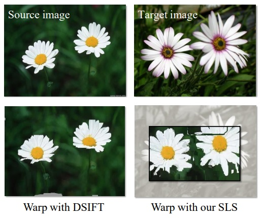
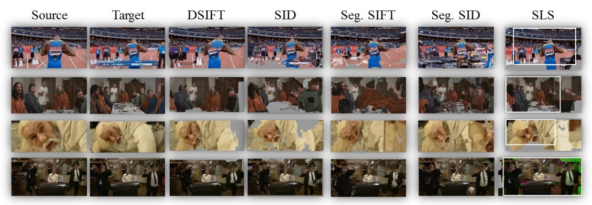

 
<b>Dense matches of different objects in different scales.</b> Top: Source and Target input images. Bottom: Source image warped onto Target using the recovered flows: Using DSIFT (bottom left) and our SLS descriptor (bottom right), overlaid on the Target and manually cropped to demonstrate the alignment. DSIFT fails to capture the scale differences and produces an output in the same scale as the input. SLS captures scale changes at each pixel: the output produced by using SLS has the appearance of the Source image in the scale and position of the Target. 

 
<b>Dense flow with scene motion.</b> Image pairs presenting different scale changes in different parts of the scene, due to camera and scene motion. Correspondences from Source to Target images estimated using [9], comparing DSIFT [8], SID [19], Segmented SID and segmented SIFT, both from [37] and our SLS, shown here with the automatically determined crop region in white

### Abstract
Scale invariant feature detectors often find stable scales in only a few image pixels. Consequently, methods for feature matching typically choose one of two extreme options: matching a sparse set of scale invariant features, or dense matching using arbitrary scales. In this paper, we turn our attention to the overwhelming majority of pixels, those where stable scales are not found by standard techniques. We ask, is scale-selection necessary for these pixels, when dense, scale-invariant matching is required and if so, how can it be achieved? We make the following contributions: (i) We show that features computed over different scales, even in low-contrast areas, can be different and selecting a single scale, arbitrarily or otherwise, may lead to poor matches when the images have different scales. (ii) We show that representing each pixel as a set of SIFTs, extracted at multiple scales, allows for far better matches than single-scale descriptors, but at a computational price. Finally, (iii) we demonstrate that each such set may be accurately represented by a low-dimensional, linear subspace. A subspace-to-point mapping may further be used to produce a novel descriptor representation, the Scale-Less SIFT (SLS), as an alternative to single-scale descriptors. These claims are verified by quantitative and qualitative tests, demonstrating significant improvements over existing methods. A preliminary version of this work appeared in [1].

[Project and Code](./2012_CVPR_1)

[Download paper here](./projects/siftscales/HassneretalTPAMI16.pdf)
