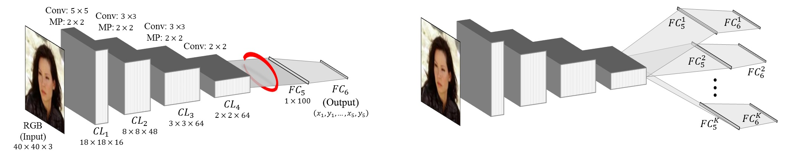

\* Denotes joint first authorship / equal contribution

 
<b>CNN architectures.</b> Left: The vanilla network described in Sec. 2.1 for facial landmark regression. We show that representations extracted from the input to FC5 (marked in red) are highly specialized and reflect facial alignment. Right: Our Tweaked CNN (TCNN) design, diverting intermediate features to K different subsequent, fine-tuned processes in the same dimensions as the original layers.

### Abstract
We present a novel convolutional neural network (CNN) design for facial landmark coordinate regression. We examine the intermediate features of a standard CNN trained for landmark detection and show that features extracted from later, more specialized layers capture rough landmark locations. This provides a natural means of applying differential treatment midway through the network, tweaking processing based on facial alignment. The resulting Tweaked CNN model (TCNN) harnesses the robustness of CNNs for landmark detection, in an appearance-sensitive manner without training multi-part or multi-scale models. Our results on the AFLW, AFW, and 300W benchmarks show improvements over existing work. We further provide results on the Janus benchmark, demonstrating the benefit of our better alignment in face verification.

[arXiv preprint](http://arxiv.org/abs/1511.04031)

[BibTeX](../projects/tcnn_landmarks/BibTeX.txt)

### Downloads
We provide the convolutional neural network models for facial landmark detection. These have been reimplemented in [Caffe](http://caffe.berkeleyvision.org/) by [Ishay Tubi](https://www.linkedin.com/in/ishay2b). 

- A [github repository](http://bit.ly/1SbTqTf) with a [Caffe](http://caffe.berkeleyvision.org/) reimplementation of the <b>Vanilla CNN</b> described in the paper. It includes code, prototype files and model weights. <b>Important note:</b> Network weights may still be updated; more accurate networks may be posted here in the future.
- Vanilla caffe model [gist](http://bit.ly/1QGcrbc)
- Please see [python notebook](https://github.com/ishay2b/VanillaCNN/blob/master/python/VanillaNoteBook.ipynb) for example usage.
- The Vanilla CNN on the [Caffe model zoo](https://github.com/BVLC/caffe/wiki/Model-Zoo#facial-landmark-detection-with-tweaked-convolutional-neural-networks)

This is ongoing work. Please check here regularly for news and updates on the downloads available for this project. 
If you find our code useful, please add suitable reference to our paper in your work.

### What's new
- <b>March 3rd, 2016:</b>
New, slightly more accurate weights have been updated on github for the Vanilla CNN.
Vanilla CNN now on Caffe model zooo.
- <b>February 24th, 2016: </b>
An initial Vanilla CNN reimplementation is now available. 

 <b>Copyright and disclaimer</b> 
Copyright 2016, Ishay Tubi, Yue Wu and Tal Hassner 
 
