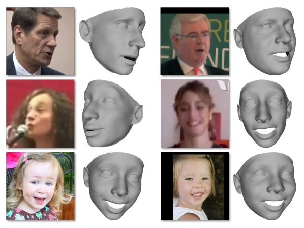
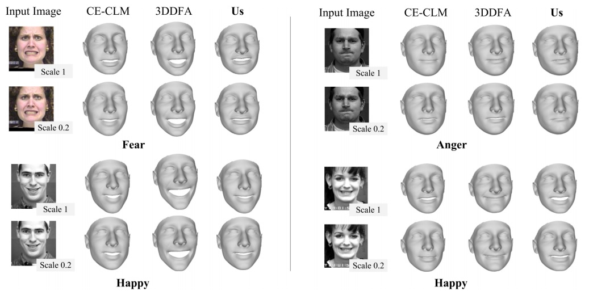
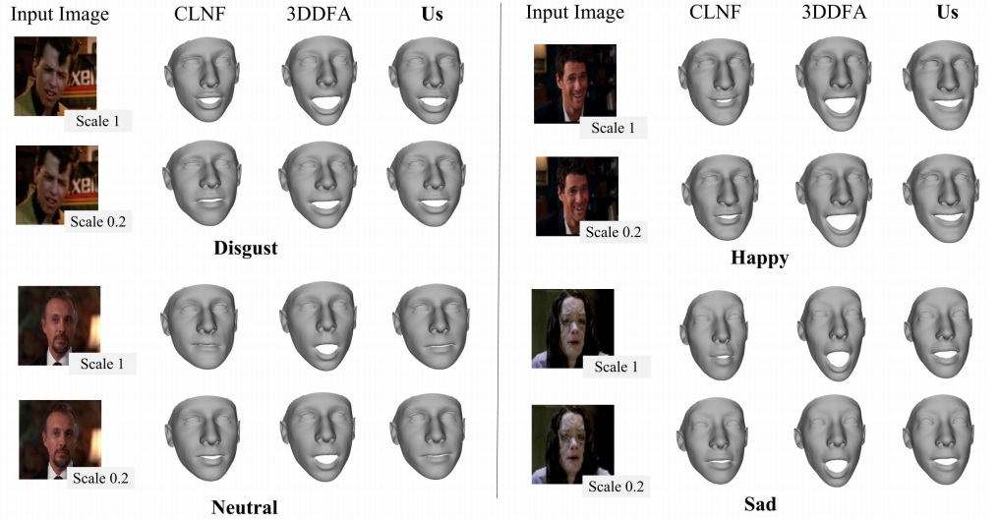

[comment]: <> () 

 
<b>Deep 3D face modeling with expressions.</b> We propose to regress 3DMM expression coefficients without facial landmark detection, directly from image intensities. We show this approach to be highly robust to extreme appearance variations, including out-of-plane head rotations (top row), scale changes (middle), and even ages (bottom). 

### Abstract
We describe a deep learning based method for estimating 3D facial expression coefficients. Unlike previous work, our process does not relay on facial landmark detection methods as a proxy step. Recent methods have shown that a CNN can be trained to regress accurate and discriminative 3D morphable model (3DMM) representations, directly from image intensities. By foregoing facial landmark detection, these methods were able to estimate shapes for occluded faces appearing in unprecedented in-the-wild viewing conditions. We build on those methods by showing that facial expressions can also be estimated by a robust, deep, landmark-free approach. Our ExpNet CNN is applied directly to the intensities of a face image and regresses a 29D vector of 3D expression coefficients. We propose a unique method for collecting data to train this network, leveraging on the robustness of deep networks to training label noise. We further offer a novel means of evaluating the accuracy of estimated expression coefficients: by measuring how well they capture facial emotions on the CK+ and EmotiW-17 emotion recognition benchmarks. We show that our ExpNet produces expression coefficients which better discriminate between facial emotions than those obtained using state of the art, facial landmark detection techniques. Moreover, this advantage grows as image scales drop, demonstrating that our ExpNet is more robust to scale changes than landmark detection methods. Finally, at the same level of accuracy, our ExpNet is orders of magnitude faster than its alternatives. 

### Some Results
More results can be found in the paper.

 
<b>Qualitative expression estimation on CK+.</b> 3D head shapes estimated by a deep 3DMM fitting method [38].
Expressions added using a number of baseline methods including our ExpNet. Our method is better able to model subtle
expressions than 3DDFA. The top-performing landmark detector, CE-CLM [46], does not perform as well on these images.

 
<b>Qualitative expression estimation on EmotiW-17.</b> 3D head shapes estimated by a deep 3DMM fitting method [38].
We add expressions using a number of baseline methods comparing them with our ExpNet. Our method and 3DDFA [49]
show consistent expression fitting across scales. Our method additionally models subtle expressions better than 3DDFA. The
top-performing facial landmark detector, CLNF [1], does not perform as well on these images

[Project and Code](https://github.com/fengju514/Expression-Net)

[arXiv preprint](https://arxiv.org/abs/1802.00542)
