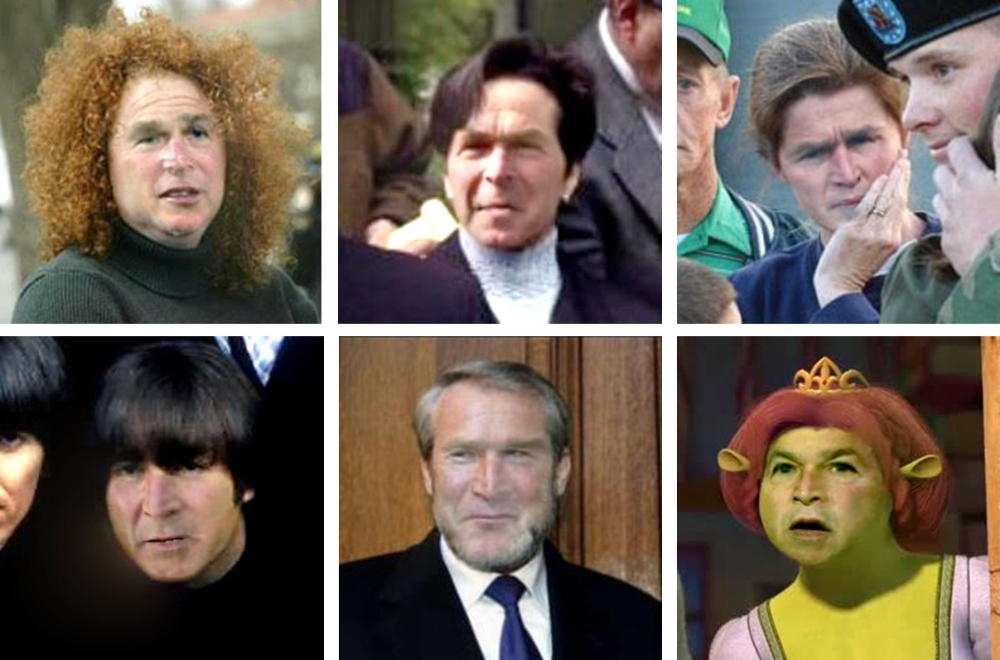
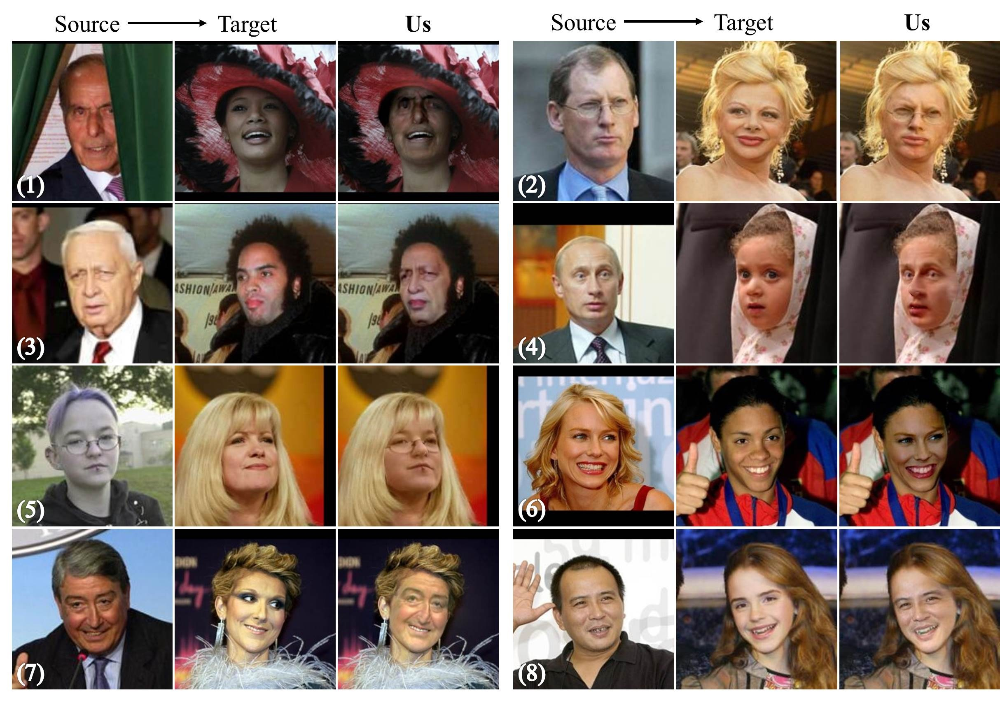
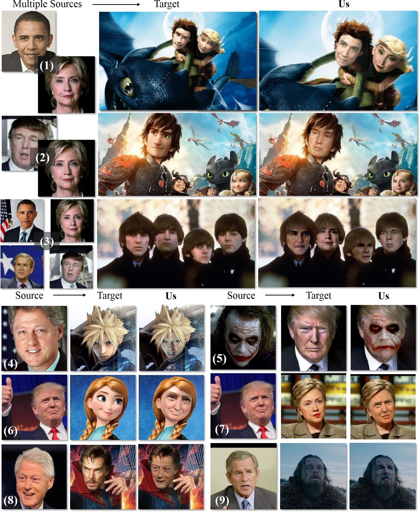

 
<b>Inter-subject swapping</b>. LFW G.W. Bush photos swapped using our method onto very different subjects and images. Unlike previous work, we do not select convenient targets for swapping. Is Bush hard to recognize? We offer quantitative evidence supporting Sinha and Poggio showing that faces and context are both crucial for recognition.

### Abstract
We show that even when face images are unconstrained and arbitrarily paired, face swapping between them is actually quite simple. To this end, we make the following contributions. (a) Instead of tailoring systems for face segmentation, as others previously proposed, we show that a standard fully convolutional network (FCN) can achieve remarkably fast and accurate segmentations, provided that it is trained on a rich enough example set. For this purpose, we describe novel data collection and generation routines which provide challenging segmented face examples. (b) We use our segmentations to enable robust face swapping under unprecedented conditions. (c) Unlike previous work, our swapping is robust enough to allow for extensive quantitative tests. To this end, we use the Labeled Faces in the Wild (LFW) benchmark and measure the effect of intra- and inter-subject face swapping on recognition. We show that our intra-subject swapped faces remain as recognizable as their sources, testifying to the effectiveness of our method. In line with well known perceptual studies, we show that better face swapping produces less recognizable inter-subject results (see, e.g., Fig. 1). This is the first time this effect was quantitatively demonstrated for machine vision systems.

[arXiv preprint](https://arxiv.org/abs/1704.06729)

[BibTeX](../projects/faceswap/BibTeX.txt)

### Some Results From Our Paper
Our method works under unprecedented conditions, swapping between faces viewed from different poses, expressions, genders, and more, and producing natural looking results. Here are some examples from the paper and supplemental material. 

 
<b>Swapping examples</b> selected from the LFW data set to represent extremely different poses (4,7,8), genders (1,2,7,8), expressions (1,7), ethnicities (1,3,6,8), ages (3-8) and occlusions (1,5).  

 
<b>More swapping examples</b> selected from arbitrary images off the web to demonstrate the extreme conditions our swapping method can handle.

### Downloads
- [Complete, end-to-end face swapping pipeline](https://github.com/YuvalNirkin/face_swap).
- [Deep face segmentation](https://github.com/YuvalNirkin/face_segmentation) (used in the face swapping pipeline.)
Note: In the paper we used a different network for our face segmentation. In the process of converting it to the Caffe model used in our end-to-end face swap distribution we notices some performance drop. We are working to fix this. We therefore ask that you please check here soon for updated on this Caffe model.
- Interactive system for fast [face segmentation ground truth labeling](https://github.com/YuvalNirkin/face_video_segment) (used to produce the training set for our deep face segmentation.)

If you find the resources below useful, please reference our paper in your work. 

This is an ongoing project and we are continually adding more features, data and information. Please check this page again for updates.

 
<b>Copyright and disclaimer</b> 
Copyright 2017, Yuval Nirkin, Iacopo Masi, Anh Tuan Tran, Tal Hassner, and Gerard Medioni 
