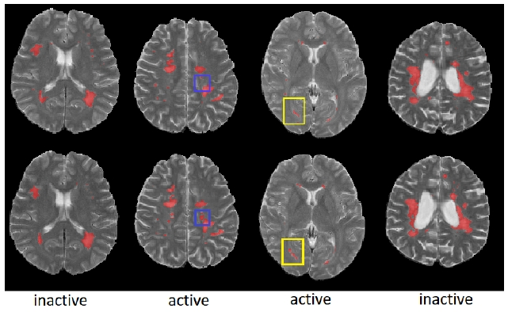

[comment]: <> ()

 
<b>Examples of brains for which the network prediction is successful.</b> (top) Baseline MRI and lesion labels (red); (bottom) Year 2 MRI and lesion labels. Blue box depicts example of a new lesion. Yellow box depicts an enlarging lesion.

### Abstract
New T2w and gadolineum-enhancing lesions in Magnetic Resonance Images (MRI) are indicators of new disease activity in Multiple Sclerosis (MS) patients. Predicting future disease activity could help predict the progression of the disease as well as ecacy of treatment. We introduce a convolutional neural network (CNN) framework for future MRI disease activity prediction in relapsing-remitting MS (RRMS) patients from multi-modal MR images at baseline and illustrate how the inclusion of T2w lesion labels at baseline cansignificantly improve prediction accuracy by drawing the attention of the network to the location of lesions. Next, we develop a segmentation network to automatically infer lesion labels when semi-manual expert lesion labels are unavailable. Both prediction and segmentation networks are trained and tested on a large, proprietary, multi-center, multi-modal, clinical trial dataset consisting of 1068 patients. Testing based on a dataset of 95 patients shows that our framework reaches very high performance levels (sensitivities of 80.11% and specificities of 79.16%) when semi-manual expert labels are included as input at baseline in addition to multi-modal MRI. Even with inferred lesion labels replacing semi-manual labels, the method significantly outperforms an identical end-to-end CNN which only includes baseline multi-modal MRI.

[PDF coming soon](./2018_MICCAIw)

[BibTex](../projects/PredictMS/BibTeX.txt)
 
