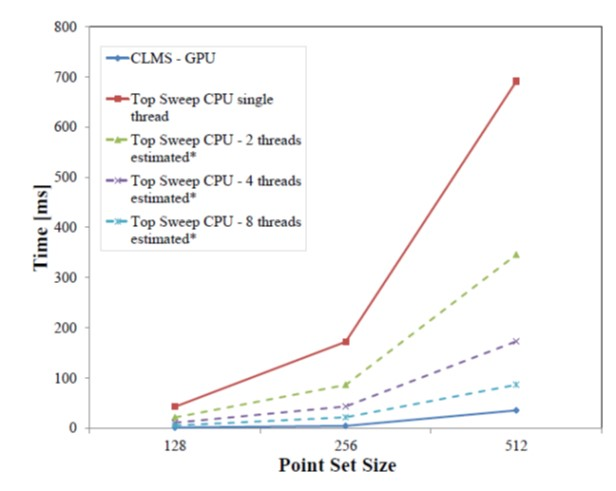

<!-- excerpt: '[<i>(much) Older preprint (link to new version forthcoming)</i>](https://arxiv.org/pdf/1510.01041.pdf)' -->
<!-- excerpt: '[<i>Download paper</i>](../projects/siftscales/HassneretalTPAMI16.pdf)'-->

 
Run-time comparison between Top Sweep [Rafalin et a.] --- the state-of-the-art LMS, sequential algorithm, --- running on a CPU and our parallel algorithm, CLMS, running on a GPU. Dashed lines represent theoretical, best case, estimates of computation time for the Top Sweep, if it were parallelized to the use of two, four, or eight threads. Importantly, as far as we know, Top Sweep has not been parallelized and cannot be executed by more than a single thread.

### Abstract
We propose an accurate and efficient 2D line detection technique based on the Standard Hough Transform (SHT) and Least Median of Squares (LMS). We prove our method to be very accurate and robust to noise and occlusions by comparing it with state of the art line detection methods using both qualitative and quantitative experiments.
LMS is known as being very robust but also as having high computation complexity. To make our method practical for real time applications, we propose a parallel algorithm for LMS computation which is based on point-line duality. We also offer a very efficient implementation of this algorithm for GPU on CUDA architecture. Despite the many years since LMS methods have first been described and the widespread use of GPU technology in computer vision and image processing systems, we are unaware of previous work reporting the use of GPUs for LMS and line detection. We measure the computation time of our GPU accelerated algorithm and prove it is suitable for real time applications. Our accelerated LMS algorithm is up to *40* times faster than the fastest single threaded CPU based implementation of the state of the art sequential algorithm.

[Code](https://github.com/ligaripash/CudaLMS2D)

[<i>Accepted version</i>](../projects/GPU_LMS/ShapiraHassner2018GPU_LMS.pdf). The final publication is available at [link.springer.com](http://link.springer.com/article/10.1007/s11554-018-0827-3).

[(much) Older preprint](https://arxiv.org/pdf/1510.01041.pdf). Full text with many more details and experiments, coming soon.
