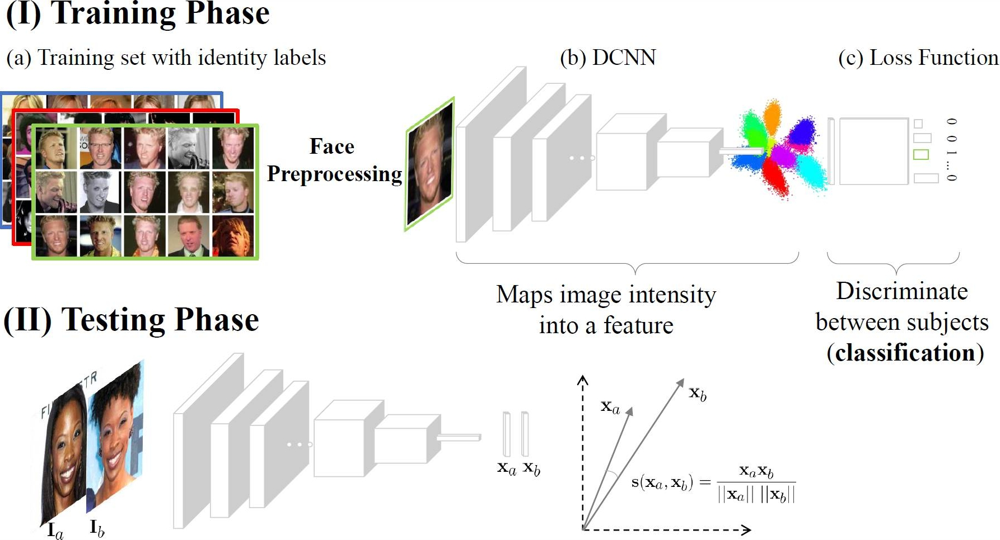

[comment]: <> ()

 
<b>Face recognition pipeline.</b> (top) Top: At training time, a huge labeled face set (a) is used to constrain the weights of a DCNN (b) optimizing a loss function (c) for the classification task. Bottom: At test time, the classification layer is often discarded, and the DCNN is used as a feature extractor for comparing face descriptors.

### Abstract
Face recognition made tremendous leaps in the last five years with a myriad of systems proposing novel techniques substantially backed by deep convolutional neural networks (DCNN). Although face recognition performance sky-rocketed using deep-learning in classic datasets like LFW, leading to the belief that this technique reached human performance, it still remains an open problem in unconstrained environments as
demonstrated by the newly released IJB datasets.
This survey aims to summarize the main advances in deep face recognition and, more in general, in learning face representations for verification and identification. The survey provides a clear, structured presentation of the principal, state-of-the-art (SOTA) face recognition techniques appearing within the past five years in top computer vision venues.
The survey is broken down into multiple parts that follow a standard face recognition pipeline: (a) how SOTA systems are trained and which public data sets have they used; (b) face preprocessing part (detection, alignment, etc.); (c) architecture and loss functions used for transfer learning (d) face recognition for verification and identification. The survey concludes with an overview of the SOTA results at a glance along with some open issues currently overlooked by the community.

[PDF](../projects/DeepFaceSurvey/Masietal2018deepfacesurvey.pdf)

[BibTex](../projects/PredictMS/BibTeX.txt)
