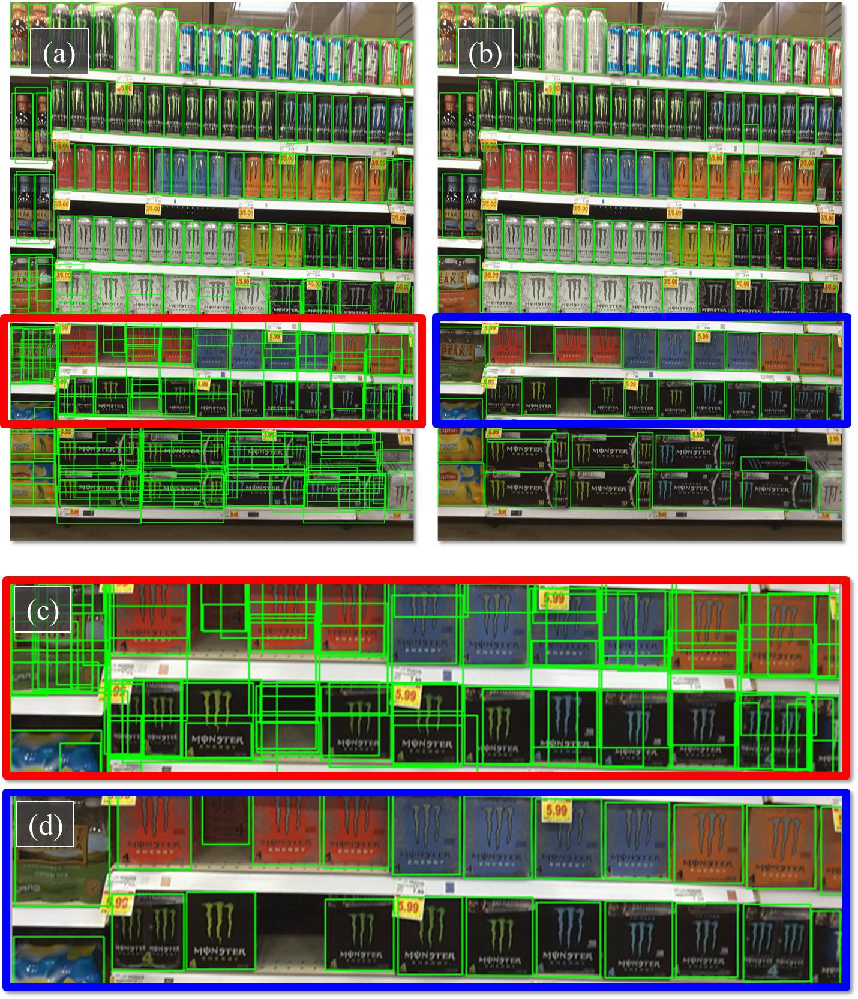

 
<b>Detection in packed domains.</b> A typical image in our SKU-110K, showing densely packed objects. (Top) (a) Detection results for the state-of-the-art RetinaNet, showing incorrect and overlapping detections, especially for the dark objects at the bottom which are harder to separate. (b) Our results showing far fewer misdetections and better fitting bounding boxes. (Bottom) Zoomed-in views for (c) RetinaNet and (d) our method.

### Abstract
Man-made scenes can be densely packed, containing numerous objects, often identical, positioned in close proximity. We show that precise object detection in such scenes remains a challenging frontier even for state-of-the-art object detectors. We propose a novel, deep-learning based method for precise object detection, designed for such challenging settings. Our contributions include: (1) A layer for estimating the Jaccard index as a detection quality score; (2) a novel EM merging unit, which uses our quality scores to resolve detection overlap ambiguities; finally, (3) an extensive, annotated data set, SKU-110K, representing packed retail environments, released for training and testing under such extreme settings. Detection tests on SKU-110K and counting tests on the CARPK and PUCPR+ show our method to outperform existing state-of-the-art with substantial margins.

[Data and code](www.github.com/eg4000/SKU110K_CVPR19)

[arXiv preprint](https://arxiv.org/abs/1904.00853)
