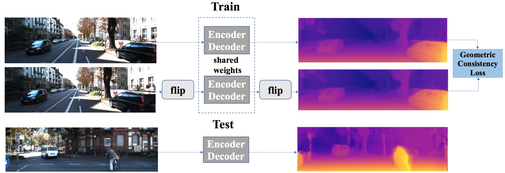

 
<b>System overview.</b> Our approach uses stereo data during training, but works on single image data during test time. Both images are treated equally by mirroring the right image. We use Siamese networks with weight sharing. This reduces computational cost and allows us to run the system on single image during test time.

### Abstract
The field of self-supervised monocular depth estimation has seen huge advancements in recent years. Most methods assume stereo data is available during training but usually under-utilize it and only treat it as a reference signal. We propose a novel self-supervised approach which uses both left and right images equally during training, but can still be used with a single input image at test time, for monocular depth estimation. Our Siamese network architecture consists of two, twin networks, each learns to predict a disparity map from a single image. At test time, however, only one of these networks is used in order to infer depth. We show state-of-the-art results on the standard KITTI Eigen split benchmark as well as being the highest scoring self-supervised method on the new KITTI single view benchmark. To demonstrate the ability of our method to generalize to new data sets, we further provide results on the Make3D benchmark, which was not used during training.

[arXiv preprint](https://arxiv.org/abs/1905.00401)

[Bibtex](../projects/monocularstereo/BibTeX.txt)

[Code and models](https://github.com/mtngld/lsim)
