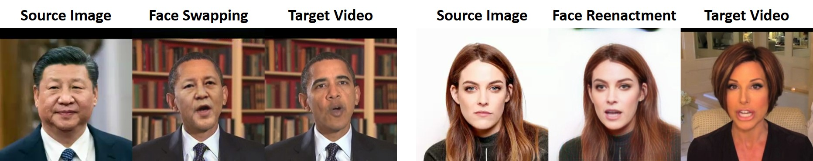

 

### Abstract
We present Face Swapping GAN (FSGAN) for face swapping and reenactment. Unlike previous work, FSGAN is subject agnostic and can be applied to pairs of faces without requiring training on those faces. To this end, we describe a number of technical contributions. We derive a novel recurrent neural network (RNN)–based approach for face reenactment which adjusts for both pose and expression variations and can be applied to a single image or a video sequence. For video sequences, we introduce continuous interpolation of the face views based on reenactment, Delaunay Triangulation, and barycentric coordinates. Occluded face regions are handled by a face completion network. Finally, we use a face blending network for seamless blending of the two faces while preserving target skin color and lighting conditions. This network uses a novel Poisson blending loss which combines Poisson optimization with perceptual loss. We compare our approach to existing state-of-the-art systems and show our results to be both qualitatively and quantitatively superior.

<iframe width="560" height="315" src="https://www.youtube.com/embed/duo-tHbSdMk" title="YouTube video player" frameborder="0" allow="accelerometer; autoplay; clipboard-write; encrypted-media; gyroscope; picture-in-picture" allowfullscreen></iframe>

[Yuval Nirkin's project page](https://nirkin.com/fsgan/)

[Paper on ArXiv](http://arxiv.org/abs/1908.05932)

[Bibtex](../projects/FSGAN/bibtex.txt)
