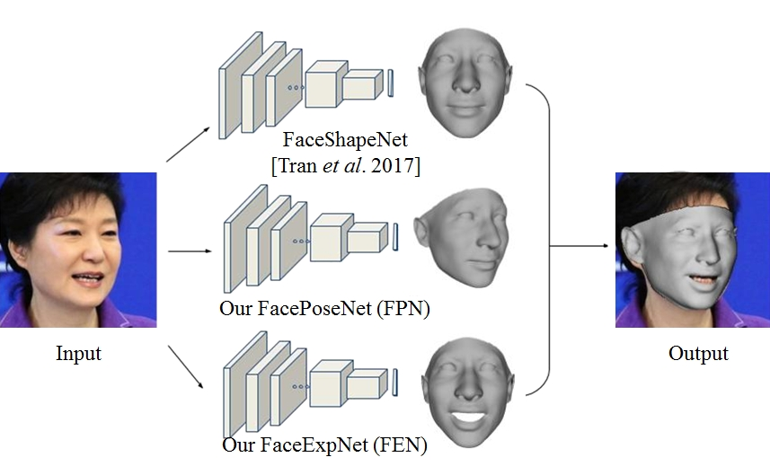

 
<b>Proposed framework for 3D face modeling.</b> Given an input face photo, we process it using three separate deep networks. These networks independently estimate, from top to bottom: the 3D face shape, 6DoF viewpoint, and 29D expression coefficients. The output is an accurate 3D face model, aligned with the input face.

### Abstract
------
We present a novel method for modeling 3D face shape, viewpoint, and expression from a single, unconstrained photo. Our method uses three deep convolutional neural networks (CNN) to estimate each of these components separately. Importantly, unlike others, our method does not use facial landmark detection at test time; instead, it estimates these properties directly from image intensities. In fact, rather than using detectors, we show how accurate landmarks can be obtained as a by-product of our modeling process. We rigorously test our proposed method. To this end, we raise a number of concerns with existing practices used in evaluating face landmark detection methods. In response to these concerns, we propose novel paradigms for testing the effectiveness of rigid and non-rigid face alignment methods without relying on landmark detection benchmarks. We evaluate rigid face alignment by measuring its effects on face recognition accuracy on the challenging IJB-A and IJB-B benchmarks. Non-rigid, expression estimation is tested on the CK+ and EmotiW'17 benchmarks for emotion classification. We do, however, report the accuracy of our approach as a landmark detector for 3D landmarks on AFLW2000-3D and 2D landmarks on 300W and AFLW-PIFA. A surprising conclusion of these results is that better landmark detection accuracy does not necessarily translate to better face processing.

### Downloads

[Preprint](../projects/FAME/IJCV__web_revision__FAME.pdf)

[Bibtex](../projects/FAME/BibTeX.txt)

Code distributions
------
[Deep regression of 3D Morphable Face Models](https://github.com/anhttran/3dmm_cnn)

[Deep face pose estimation](https://github.com/fengju514/Face-Pose-Net)

[Deep face expression deformation](https://github.com/fengju514/Expression-Net)

See also a follow-up project which includes all the above as well as mid-level facial details and occlusion handling:
[Extreme 3D face reconstruction](https://github.com/anhttran/extreme_3d_faces) Available also as a docker for easy install.  
