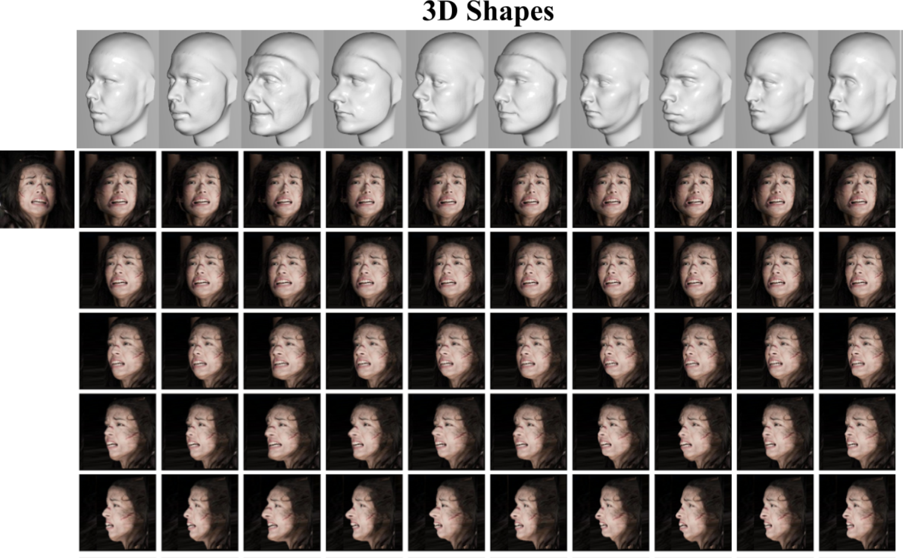

 
<b>The (insignificant) effects of 3D shapes on faces rendered from multiple poses.</b> Top: Ten generic 3D face shapes used for rendering. Bottom: Input image (on the left) is rendered at different poses (rows) and with different 3D shapes (columns). Different shapes induce subtle appearance variations yet do not change the perceived identity of the face in the image, irrespective of the gender, expression, occlusions, age, and ethnicity of the input subject. By abandoning 3D reconstruction, we show that face rendering can be performed at breakneck speeds, on-line, during training with a novel 3D augmentation layer. These novel views add intra-class appearance variations and substantially improve recognition accuracy. This augmentation comes at negligible compute costs and no additional storage required for the rendered views.

Abstract
------
We identify two issues as key to developing effective face recognition systems: maximizing the appearance variations of training images and minimizing appearance variations in test images. The former is required to train the system for whatever appearance variations it will ultimately encounter and is often addressed by collecting massive training sets with millions of face images. The latter involves various forms of appearance normalization for removing distracting
nuisance factors at test time and making test faces easier to compare. We describe novel, efficient face-specific data augmentation techniques and show them to be ideally suited for both purposes. By using knowledge of faces, their
3D shapes, and appearances, we show the following: (a) We can artificially enrich training data for face recognition with face-specific appearance variations. (b) This synthetic training data can be efficiently produced online, thereby reducing the massive storage requirements of large-scale training sets and simplifying training for many appearance variations. Finally, (c) The same, fast data augmentation techniques can be applied at test time to reduce appearance variations and improve face representations. Together, with additional technical novelties, we describe a highly effective face recognition pipeline which, at the time of submission, obtains state-of-the-art results across multiple benchmarks

[Preprint](../projects/augmented_faces/Masietal_IJCV2019.pdf)

[View-only final version on Springer Nature](https://rdcu.be/bukiP)

[Bibtex](../projects/augmented_faces/BibTeXIJCV19.txt)

Code distributions
------
[Augmentation layer for on-line novel 3D face view synthesis](https://github.com/iacopomasi/face_specific_augm/tree/master/cow_data_layer)

Looking for an accurate 3D face alignment method? See this project, now with a new and highly accuracy ResNet101 architecture:
[FacePoseNet](https://github.com/fengju514/Face-Pose-Net).  
