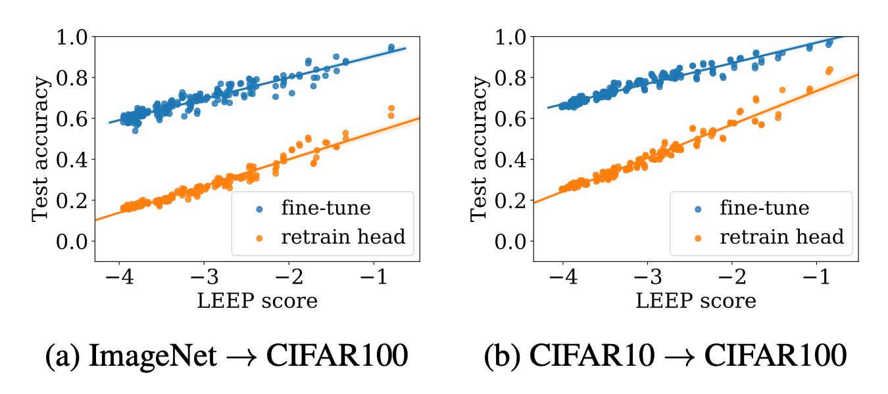

 
<b>LEEP scores vs. test accuracies</b>  for two transfer learning algorithms, together with their best fit lines, reported for transferred models on 200 random tasks constructed from CIFAR100 data. The source models are (a) ResNet18 pre-trained on ImageNet, and (b) ResNet20 pre-trained on CIFAR10. See paper for more details.

### Abstract
We introduce a new measure to evaluate the transferability of representations learned by classifiers. Our measure, the Log Expected Empirical Prediction (LEEP), is simple and easy to compute: when given a classifier trained on a source data set, it only requires running the target data set through this classifier once. We analyze the properties of LEEP theoretically and demonstrate its effectiveness empirically. Our analysis shows that LEEP can predict the performance and convergence speed of both transfer and meta-transfer learning methods, even for small or imbalanced data. Moreover, LEEP outperforms recently proposed transferability measures such as negative conditional entropy and H scores. Notably, when transferring from ImageNet to CIFAR100, LEEP can achieve up to 30% improvement compared to the best competing method in terms of the correlations with actual transfer accuracy.

[Paper](https://arxiv.org/pdf/2002.12462.pdf)

[bibtex](../projects/LEEP/bibtex.txt)
