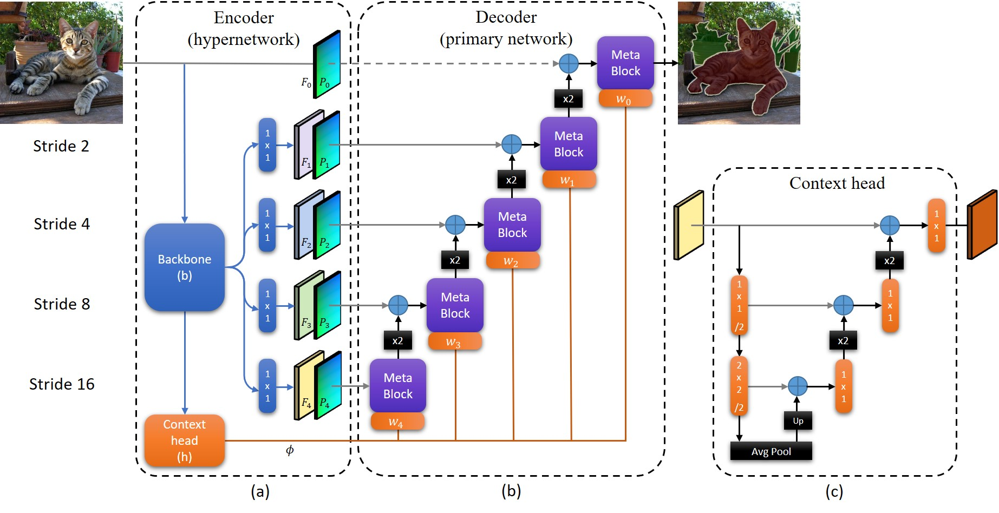

 
<b>Method overview.</b> (a) The hypernetwork encoder based on an EfficientNet backbone, <i>b</i>, with its final layer replaced by the context head, <i>h</i>. (b) The primary network decoder, <i>b</i>, and layers <i>w_i</i> of the weight mapping network, <i>w</i>, embedded in each meta block. The input to the decoder, <i>d</i>, are the input image and the features, <i>F_i</i>, concatenated with positional embedding, <i>P_i</i>. Its weights are determined <i>dynamically</i> for each patch in the image. Gray arrows represent skip connections, x2 blocks are bilinear upsampling, and the blue '+' signs are concatenations. (c) The context head is designed as a nested U-Net. Please see the paper for more details.

### Abstract
We present a novel, real-time, semantic segmentation network in which the encoder both encodes and generates the parameters (weights) of the decoder. Furthermore, to allow maximal adaptivity, the weights at each decoder block vary spatially. For this purpose, we design a new type of hypernetwork, composed of a nested U-Net for drawing higher level context features, a multi-headed weight generating module which generates the weights of each block in the decoder immediately before they are consumed, for efficient memory utilization, and a primary network that is composed of novel dynamic patch-wise convolutions. Despite the usage of less-conventional blocks, our architecture obtains real-time performance. In terms of the runtime vs. accuracy trade-off, we surpass state of the art (SotA) results on popular semantic segmentation benchmarks: PASCAL VOC 2012 (val. set) and real-time semantic segmentation on Cityscapes, and CamVid.

[arXiv preprint](https://arxiv.org/abs/2012.11582)

[Bibtex](../projects/hyperseg/BibTeX.txt)

Code coming soon!
