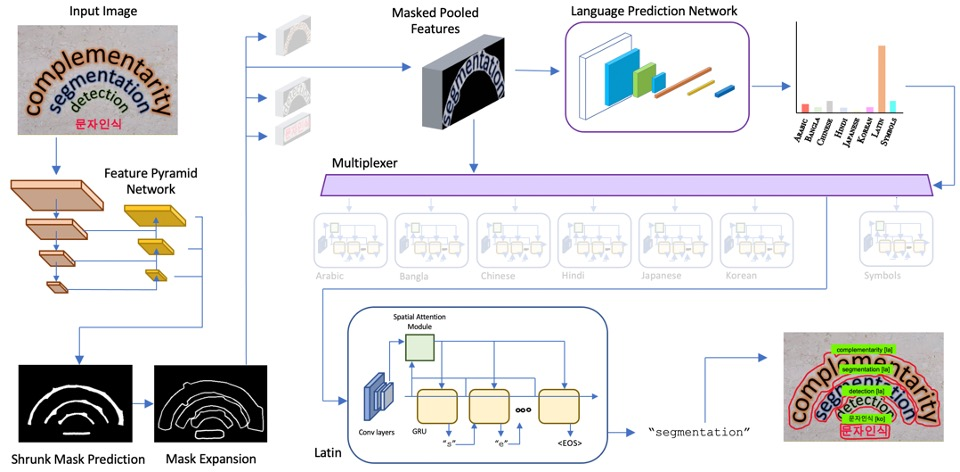

 
<b>M3 TextSpotter.</b> The proposed M3 TextSpotter shares the same detection and segmentation trunk with Mask TextSpotter v3 [Liao et al. ECCV'20], but incorporates a novel Language Prediction Network (LPN). The output of the LPN then determines which script's recognition head the multiplexer selects.

### Abstract
Recent advances in OCR have shown that an end-to-end (E2E) training pipeline that includes both detection and recognition leads to the best results. However, many existing methods focus primarily on Latin-alphabet languages, often even only case-insensitive English characters. In this paper, we propose an E2E approach, Multiplexed Multilingual Mask TextSpotter, that performs script identification at the word level and handles different scripts with different recognition heads, all while maintaining a unified loss that simultaneously optimizes script identification and multiple recognition heads. Experiments show that our method outperforms the single-head model with similar number of parameters in end-to-end recognition tasks, and achieves state-of-the-art results on MLT17 and MLT19 joint text detection and script identification benchmarks. We believe that our work is a step towards the end-to-end trainable and scalable multilingual multi-purpose OCR system. Our code and model will be released.

[arXiv preprint](https://arxiv.org/abs/2103.15992)

[Bibtex](../projects/multiplexerOCR/BibTeX.txt)

[Code](https://github.com/facebookresearch/MultiplexedOCR)
