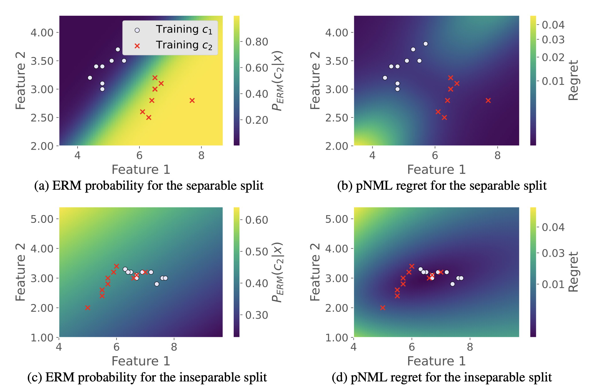

 
A single layer NN fitted to low dimensional data (the Iris flower set (Fisher, 1936)). (a) and (c) show the ERM probability assignment of class c2 for a separable split and inseparable split respectively. The derived pNML regret for the separable split is shown in (b) and for the inseparable split is shown in (d). The training data of class c1 and c2 are marked with red circles and red crosses respectively. Low regret is associated with the training data surroundings.

### Abstract
Detecting out-of-distribution (OOD) samples is vital for developing machine learning based models for critical safety systems. Common approaches for OOD detection assume access to some OOD samples during training which may not be available in a real-life scenario. Instead, we utilize the <i>predictive normalized maximum likelihood</i> (pNML) learner, in which no assumptions are made on the tested input. We derive an explicit expression of the pNML and its generalization error, denoted as the <i>regret</i>, for a single layer neural network (NN). We show that this learner generalizes well when (i) the test vector resides in a subspace spanned by the eigenvectors associated with the large eigenvalues of the empirical correlation matrix of the training data, or (ii) the test sample is far from the decision boundary. Furthermore, we describe how to efficiently apply the derived pNML regret to any pretrained deep NN, by employing the explicit pNML for the last layer, followed by the softmax function. Applying the derived regret to deep NN requires neither additional tunable parameters nor extra data. We extensively evaluate our approach on 74 OOD detection benchmarks using DenseNet-100, ResNet-34, and WideResNet-40 models trained with CIFAR-100, CIFAR-10, SVHN, and ImageNet-30 showing a significant improvement of up to 15.6% over recent leading methods.

[arXiv preprint](https://arxiv.org/abs/2110.09246)

[Bibtex](../projects/pNML/BibTeX.txt)

[Code](https://github.com/kobybibas/pnml_ood_detection)
