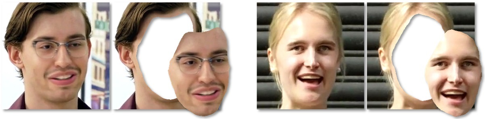

 
<b>Detecting swapped faces by comparing faces and their context.</b>  Two example fake (swapped) faces from the DFD data set. Left: The arm of the eyeglasses does not extend from face to context. Right: An apparent identity mismatch between face and context. We show how these and similar discrepancies can be used as powerful signals for automatic detection of swapped faces.

### Abstract
We propose a method for detecting face swapping and other identity manipulations in single images. Face swapping methods, such as DeepFake, manipulate the face region, aiming to adjust the face to the appearance of its context, while leaving the context unchanged. We show that this modus operandi produces discrepancies between the two regions (e.g., teaser figure above). These discrepancies offer exploitable telltale signs of manipulation. Our approach involves two networks: (i) a face identification network that considers the face region bounded by a tight semantic segmentation, and (ii) a context recognition network that considers the face context (e.g., hair, ears, neck). We describe a method which uses the recognition signals from our two networks to detect such discrepancies, providing a complementary detection signal that improves conventional real vs. fake classifiers commonly used for detecting fake images. Our method achieves state of the art results on the FaceForensics++, Celeb-DF-v2, and DFDC benchmarks for face manipulation detection, and even generalizes to detect fakes produced by unseen methods.

[arXiv preprint](https://arxiv.org/abs/2008.12262)

[Bibtex](../projects/DeepFakeDetect_Face_vs_context/BibTeX.txt)

[Paper on TPAMI early access](https://www.computer.org/csdl/journal/tp/5555/01/09468380/1uPuNufSjRu)
