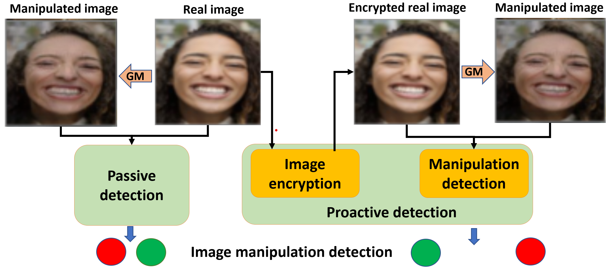

 
<b>Passive vs. proactive image manipulation detection.</b> Classic passive schemes take an image as it is to discriminate a real image vs. its manipulated one created by a Generative Model (GM). In contrast, our proactive scheme performs encryption of the real image so that our detection module can better discriminate the encrypted real image vs. its manipulated counterpart.

### Abstract
Image manipulation detection algorithms are often trained to discriminate between images manipulated with particular Generative Models (GMs) and genuine/real images, yet generalize poorly to images manipulated with GMs unseen in the training. Conventional detection algorithms receive an input image passively. By contrast, we propose a proactive scheme to image manipulation detection. Our key enabling technique is to estimate a set of templates which when added onto the real image would lead to more accurate manipulation detection. That is, a template protected real image, and its manipulated version, is better discriminated compared to the original real image vs. its manipulated one. These templates are estimated using certain constraints based on the desired properties of templates. For image manipulation detection, our proposed approach outperforms the prior work by an average precision of 16% for CycleGAN and 32% for GauGAN. Our approach is generalizable to a variety of GMs showing an improvement over prior work by an average precision of 10% averaged across 12 GMs. 

[arXiv preprint](https://arxiv.org/abs/2203.15880)

[Bibtex](../projects/ProactiveManipulationDetection/BibTeX.txt)

[Data and code](https://www.github.com/vishal3477/proactive_IMD)
