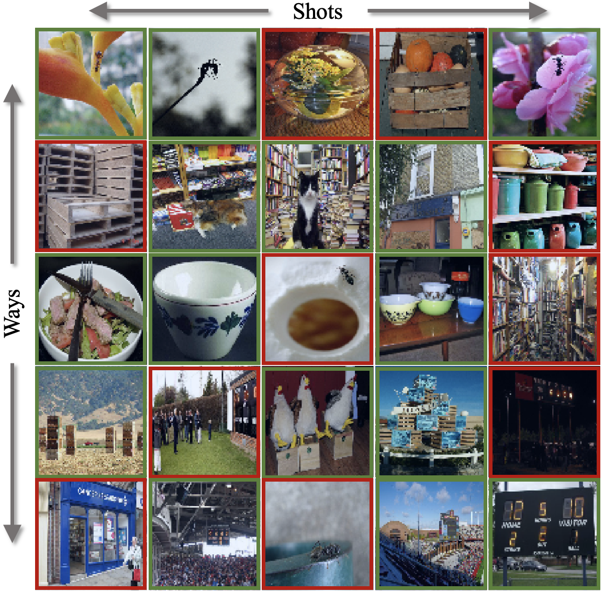

 
<b>Few-shot learning with mislabeled samples.</b> A 5-shot, 5-way support set of MiniImageNet images. Rows show support set samples of each novel class. Two samples in each row were mislabeled by symmetric label flips (see Sec. 6.1 in the paper). importantly, only two mislabeled samples represent a 40% label error rate, making this problem particularly challenging, even for humans. Can you spot which ones were mislabeled in this figure? See Appx. in the paper for answers and more examples.

### Abstract
Few-shot learning (FSL) methods typically assume clean support sets with accurately labeled samples when training on novel classes. This assumption can often be unrealistic: support sets, no matter how small, can still include mislabeled samples. Robustness to label noise is therefore essential for FSL methods to be practical, but this problem surprisingly remains largely unexplored. To address mislabeled samples in FSL settings, we make several technical contributions. (1) We offer simple, yet effective, feature aggregation methods, improving the prototypes used by ProtoNet, a popular FSL technique. (2) We describe a novel Transformer model for Noisy Few-Shot Learning (TraNFS). TraNFS leverages a transformer's attention mechanism to weigh mislabeled versus correct samples. (3) Finally, we extensively test these methods on noisy versions of MiniImageNet and TieredImageNet. Our results show that TraNFS is on-par with leading FSL methods on clean support sets, yet outperforms them, by far, in the presence of label noise.

[arXiv preprint](https://arxiv.org/abs/2204.05494)

[Bibtex](../projects/NoisyFewShot/BibTeX.txt)

[Data and code](https://www.github.com/vishal3477/proactive_IMD)

