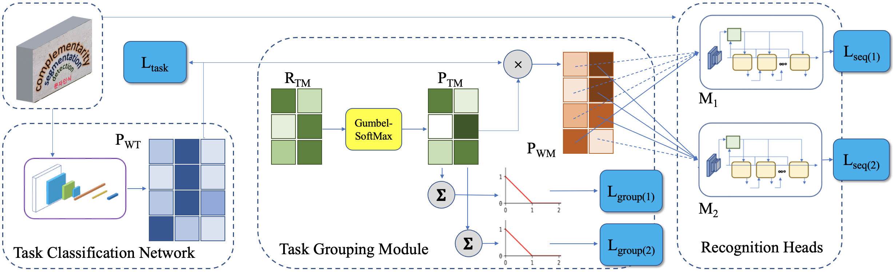

 
<b>Our proposed task grouping framework.</b> Here we show a batch of 4 inputs potentially belonging to 3 tasks, with 2 recognition heads. See Sec. 3 in the paper for more details.

### Abstract
Most existing OCR methods focus on alphanumeric characters due to the popularity of English and numbers, as well as their corresponding datasets. On extending the characters to more languages, recent methods have shown that training different scripts with different recognition heads can greatly improve the end-to-end recognition accuracy compared to combining characters from all languages in the same recognition head. However, we postulate that similarities between some languages could allow sharing of model parameters and benefit from joint training. Determining language groupings, however, is not immediately obvious. To this end, we propose an automatic method for multilingual text recognition with a task grouping and assignment module using Gumbel-Softmax, introducing a task grouping loss and weighted recognition loss to allow for simultaneous training of the models and grouping modules. Experiments on MLT19 lend evidence to our hypothesis that there is a middle ground between combining every task together and separating every task that achieves a better configuration of task grouping/separation.

[Download paper here](https://arxiv.org/pdf/2210.07423.pdf)

[Bibtex](../projects/multiplexerOCRGrouper/BibTeX.txt)
