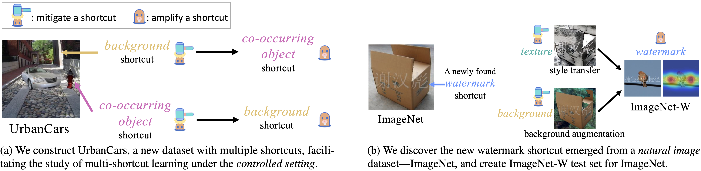

 
Our benchmark results on UrbanCars and ImageNet reveal the overlooked Whac-A-Mole dilemma in shortcut mitigation, i.e., mitigating one shortcut amplifies the reliance on other shortcuts.

### Abstract
problem under the tenuous assumption that only a single shortcut exists in the training data. Real-world images are rife with multiple visual cues from background to texture. Key to advancing the reliability of vision systems is understanding whether existing methods can overcome multiple shortcuts or struggle in a Whac-A-Mole game, i.e., where mitigating one shortcut amplifies reliance on others. To address this shortcoming, we propose two benchmarks: 1) UrbanCars, a dataset with precisely controlled spurious cues, and 2) ImageNet-W, an evaluation set based on ImageNet for watermark, a shortcut we discovered affects nearly every modern vision model. Along with texture and background, ImageNet-W allows us to study multiple shortcuts emerging from training on natural images. We find computer vision models, including large foundation models -- regardless of training set, architecture, and supervision -- struggle when multiple shortcuts are present. Even methods explicitly designed to combat shortcuts struggle in a Whac-A-Mole dilemma. To tackle this challenge, we propose Last Layer Ensemble, a simple-yet-effective method to mitigate multiple shortcuts without Whac-A-Mole behavior. Our results surface multi-shortcut mitigation as an overlooked challenge critical to advancing the reliability of vision systems. The datasets and code are released: [this https URL](https://github.com/facebookresearch/Whac-A-Mole).

[arXiv preprint](https://arxiv.org/abs/2212.04825)

[Data and code](https://github.com/facebookresearch/Whac-A-Mole)

### BibTex:


@inproceedings{li2022whac,
  title={A Whac-A-Mole Dilemma: Shortcuts Come in Multiples Where Mitigating One Amplifies Others},
  author={Li, Zhiheng and Evtimov, Ivan and Gordo, Albert and Hazirbas, Caner and Hassner, Tal and Ferrer, Cristian Canton and Xu, Chenliang and Ibrahim, Mark},
  booktitle={CVF/IEEE Conf. on Computer Vision and Pattern Recognition (CVPR)},
  URL = {\url{https://talhassner.github.io/home/publication/2023_CVPR_1}},
  year={2023}
}



