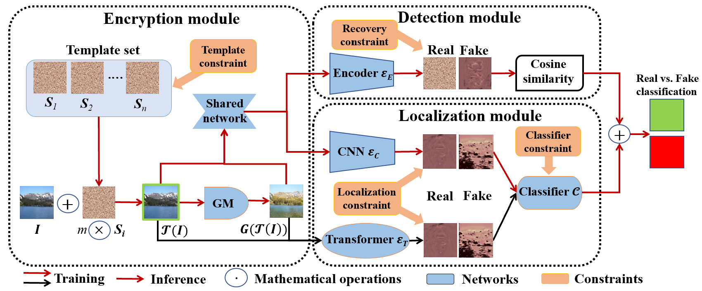

 
<b>The overview of MaLP.</b> It includes three modules: encryption, localization, and detection. We randomly select a template from
the template set and add it to the real image as encryption. The GM is used in inference mode to manipulate the encrypted image. The
detection module recovers the added template for binary detection. The localization module uses a two-branch architecture to estimate the
fakeness map. Lastly, we apply the classifier to the fakeness map to better distinguish them from each other. Best viewed in color.

### Abstract
Advancements in the generation quality of various Generative Models (GMs) has made it necessary to not only perform binary manipulation detection but also localize the modified pixels in an image. However, prior works termed as passive for manipulation localization exhibit poor generalization performance over unseen GMs and attribute modifications. To combat this issue, we propose a proactive scheme for manipulation localization, termed MaLP. We encrypt the real images by adding a learned template. If the image is manipulated by any GM, this added protection from the template not only aids binary detection but also helps in identifying the pixels modified by the GM. The template is learned by leveraging local and global-level features estimated by a two-branch architecture. We show that MaLP performs better than prior passive works. We also show the generalizability of MaLP by testing on 22 different GMs, providing a benchmark for future research on manipulation localization. Finally, we show that MaLP can be used as a discriminator for improving the generation quality of GMs. Our models/codes are available at [this http URL](http://www.github.com/vishal3477/pro_loc).

[arXiv preprint](https://arxiv.org/abs/2303.16976)

[Data and code](http://www.github.com/vishal3477/pro_loc)

### BibTex:


@inproceedings{asnani2023pro_loc
      title={{MaLP}: Manipulation Localization Using a Proactive Scheme}, 
      author={Asnani, Vishal and Yin, Xi and Hassner, Tal and Liu, Xiaoming},
      booktitle={IEEE/CVF Conference on Computer Vision and Pattern Recognition (CVPR)},
      URL = {\url{https://talhassner.github.io/home/publication/2023_CVPR_2}},
      year={2023}     
}
}



