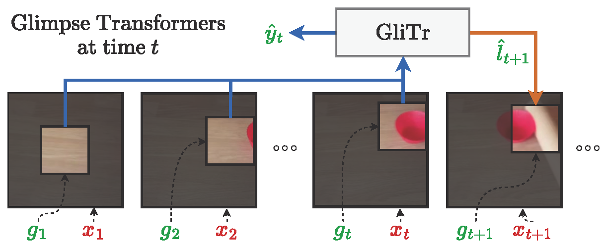

 
<b>Our proposed Glimpse Transformers (GliTr)</b>, an online action prediction model that only attends to the most informative glimpses in the frames. While never observing frames completely, GliTr predicts labels (i.e. an estimate of ongoing action at time <i>t</i>) and the next glimpse location at time <i>t+1</i> based solely on the glimpses observed up to <i>t</i>. 

### Abstarct
Many online action prediction models observe complete frames to locate and attend to informative subregions in the frames called glimpses and recognize an ongoing action based on global and local information. However, in applications with constrained resources, an agent may not be able to observe the complete frame, yet must still locate useful glimpses to predict an incomplete action based on local information only. In this paper, we develop Glimpse Transformers (GliTr), which observe only narrow glimpses at all times, thus predicting an ongoing action and the following most informative glimpse location based on the partial spatiotemporal information collected so far. In the absence of a ground truth for the optimal glimpse locations for action recognition, we train GliTr using a novel spatiotemporal consistency objective: We require GliTr to attend to the glimpses with features similar to the corresponding complete frames (i.e. spatial consistency) and the resultant class logits at time t equivalent to the ones predicted using whole frames up to t (i.e. temporal consistency). Inclusion of our proposed consistency objective yields ~10% higher accuracy on the Something-Something-v2 (SSv2) dataset than the baseline cross-entropy objective. Overall, despite observing only ~33% of the total area per frame, GliTr achieves 53.02%and 93.91% accuracy on the SSv2 and Jester datasets, respectively.

[Paper on ArXiv](https://arxiv.org/pdf/2210.13605.pdf)

BibTex:
> @inproceedings{rangrej2022glitr,
>  title={{GliTr}: Glimpse Transformers with Spatiotemporal Consistency for Online Action Prediction},
>  author={Rangrej, Samrudhdhi B and Liang, Kevin J and Hassner, Tal and Clark, James J},
>  booktitle={IEEE/CVF Winter Conference on Applications of Computer Vision (WACV)},
>  year={2023}
> }
